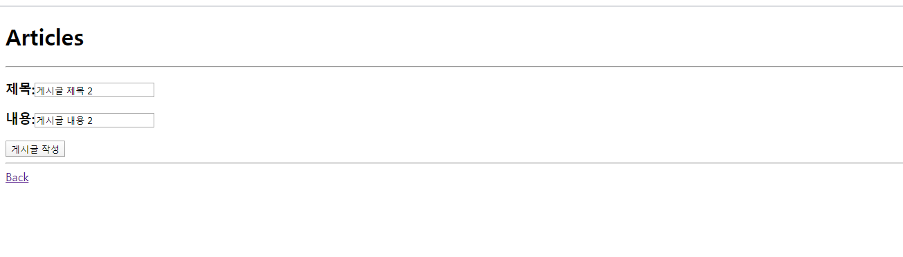
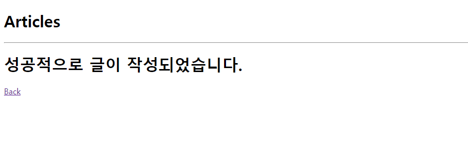
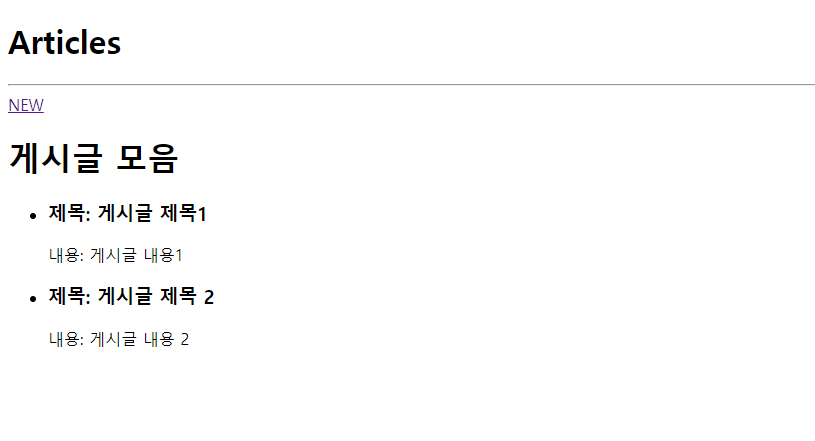

### 코드 

#### 1.  crud/settings.py 

```python
TEMPLATES = [
    {
        'BACKEND': 'django.template.backends.django.DjangoTemplates',
        'DIRS': [
            os.path.join(BASE_DIR,'templates')
            ],
        'APP_DIRS': True,
        'OPTIONS': {
            'context_processors': [
                'django.template.context_processors.debug',
                'django.template.context_processors.request',
                'django.contrib.auth.context_processors.auth',
                'django.contrib.messages.context_processors.messages',
            ],
        },
    },
]
```


#### 2. crud/urls.py

```python
from django.contrib import admin
from django.urls import path, include

urlpatterns = [
    path('admin/', admin.site.urls),
    path('articles/',include('articles.urls')),
]

```


#### 3. articles/urls.py

```python
from django.urls import path
from . import views

urlpatterns=[
    path('',views.index),
    path('new/',views.new),
    path('create/',views.create)
]
```


#### 4. articles/views.py

```python
from django.shortcuts import render
from .models import Article
# Create your views here.

def index(request):
    articles=Article.objects.all()
    context={
        'articles':articles,
    }
    return render(request,'index.html',context)

def new(request):
    return render(request,'new.html')

def create(request):
    articles=Article()
    articles.title=request.GET.get('title')
    articles.content=request.GET.get('content')
    articles.save()

    return render(request,'create.html')
```


#### 5. crud/templates/base.html

```html
<!DOCTYPE html>
<html lang="ko">
<head>
    <meta charset="UTF-8">
    <meta name="viewport" content="width=device-width, initial-scale=1.0">
    <meta http-equiv="X-UA-Compatible" content="ie=edge">
    <title>Document</title>
</head>
<body>
    <h1>Articles</h1>
    <hr>
    
    
</body>
</html>
```


#### 6.templates/articles/index.html

```html






    <a href="/articles/new/">NEW</a>
    <h1> 게시글 모음 </h1>

    
    <ul>
        <li><h3>제목: {{ article.title }}</h3></li>
        내용: {{ article.content }}
    </ul>
    


```

#### 7. templates/articles/new.html

```html




<form action="/articles/create/">
    <h3>제목:<input type="text" name="title"><br></h3>
    <h3>내용:<input type="text" name="content"><br></h3>
    <input type="submit" value="게시글 작성">

</form>
<hr>
<a href="/articles/">Back</a>

```


#### 8. templates/articles/create.html

```html


<h1>성공적으로 글이 작성되었습니다.</h1>

<a href="/articles/">Back</a>

```


## 결과 사진

#### NEW 페이지



#### CREATE 페이지



#### index 페이지

