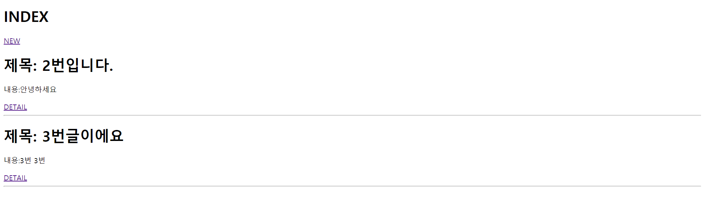
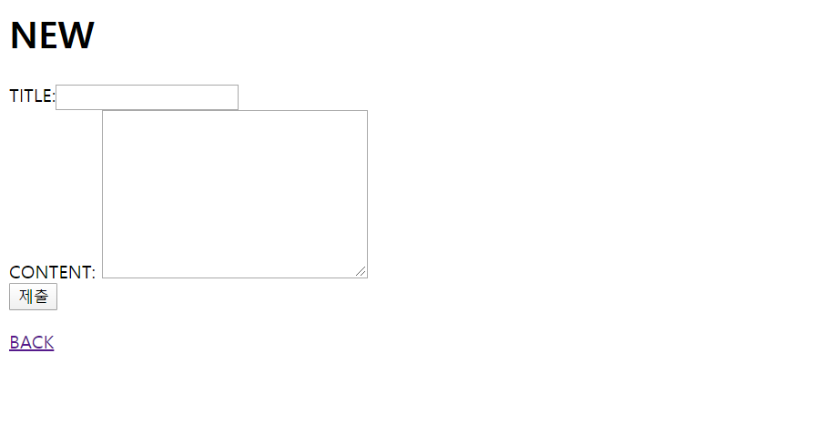
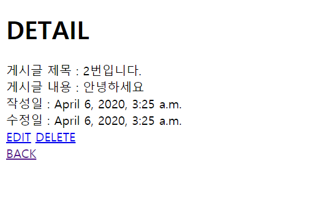
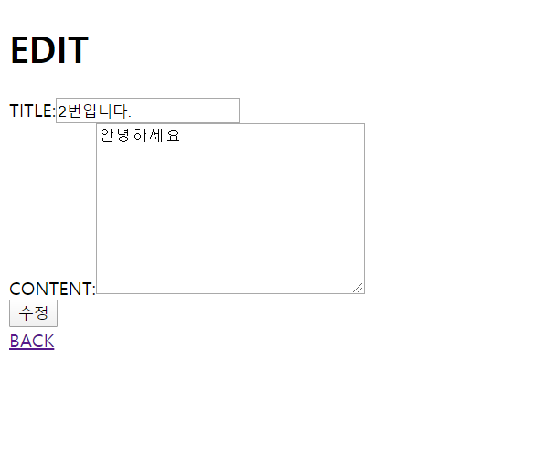

# 0406_exercise


## 1. 소스

#### urls.py

```python
from django.urls import path
from . import views

urlpatterns=[
    path('',views.index),
    path('new/',views.new),
    path('create/',views.create),
    path('<int:id>/',views.detail),
    path('<int:id>/edit',views.edit),
    path('<int:id>/update',views.update),
    path('<int:id>/delete',views.delete)
]
```

#### views.py

```python
from django.shortcuts import render,redirect
from .models import Articles
# Create your views here.
def index(request):
    articles=Articles.objects.all()
    context={
        'articles':articles
    }
    return render(request,'articles/index.html',context)


def new(request):
    return render(request,'articles/new.html')

def create(request):
    article=Articles()
    article.title=request.GET.get('title')
    article.content=request.GET.get('content')
    article.save()
    # return render(request,'articles/create.html')
    return redirect('/articles/')

def detail(request,id):
    article=Articles.objects.get(id=id)
    context={
        'article':article,
    }
    return render(request,'articles/detail.html',context)

def edit(request,id):
    article=Articles.objects.get(id=id)
    context={
        'article':article,
    }
    return render(request,'articles/edit.html',context)

def update(request,id):
    article=Articles.objects.get(id=id)
    article.title=request.GET.get('title')
    article.content=request.GET.get('content')
    article.save()
    return redirect(f'/articles/{article.id}')

def delete(request,id):
    article=Articles.objects.get(id=id)
    article.delete()
    return redirect('/articles')
```

#### models.py

```python
from django.db import models

# Create your models here.
class Articles(models.Model):
    title=models.CharField(max_length=140)
    content = models.TextField()
    created_at=models.DateTimeField(auto_now_add=True)
    updated_at=models.DateTimeField(auto_now=True)
```

#### base.html

```html
<!DOCTYPE html>
<html lang="en">
<head>
    <meta charset="UTF-8">
    <meta name="viewport" content="width=device-width, initial-scale=1.0">
    <meta http-equiv="X-UA-Compatible" content="ie=edge">
    <title>Document</title>
    <link rel="stylesheet" href="https://stackpath.bootstrapcdn.com/bootstrap/4.4.1/css/bootstrap.min.css" integrity="sha384-Vkoo8x4CGsO3+Hhxv8T/Q5PaXtkKtu6ug5TOeNV6gBiFeWPGFN9MuhOf23Q9Ifjh" crossorigin="anonymous">
</head>
<body>
    

    
    <script src="https://code.jquery.com/jquery-3.4.1.slim.min.js" integrity="sha384-J6qa4849blE2+poT4WnyKhv5vZF5SrPo0iEjwBvKU7imGFAV0wwj1yYfoRSJoZ+n" crossorigin="anonymous"></script>
<script src="https://cdn.jsdelivr.net/npm/popper.js@1.16.0/dist/umd/popper.min.js" integrity="sha384-Q6E9RHvbIyZFJoft+2mJbHaEWldlvI9IOYy5n3zV9zzTtmI3UksdQRVvoxMfooAo" crossorigin="anonymous"></script>
<script src="https://stackpath.bootstrapcdn.com/bootstrap/4.4.1/js/bootstrap.min.js" integrity="sha384-wfSDF2E50Y2D1uUdj0O3uMBJnjuUD4Ih7YwaYd1iqfktj0Uod8GCExl3Og8ifwB6" crossorigin="anonymous"></script>
</body>
</html>
```

#### index.html

```html



<h1>INDEX</h1>
<a href="/articles/new">NEW</a>



    <h1>제목: {{ article.title }}</h1>
    <p>내용:{{ article.content}}</p>
    <a href="/articles/{{ article.id }}">DETAIL</a>
    <hr>





```

#### new.html

```html



    <h1> 글쓰기 </h1>
    <form action="/articles/create/" method="POST">
        
        제목 : <input type="text" name="title">
        내용 : <input type="text" name="content">
        <input type="submit" value="작성완료">
    </form>

```

#### detail.html

```html



<h1>EDIT</h1>
<form action="/articles/{{ article.id }}/update">
    TITLE:<input type="text" name="title" value="{{ article.title }}"><br>
    CONTENT:<textarea name="content" id="" cols="30" rows="10">{{ article.content }}
    </textarea><br>
    <input type="submit" value="수정">
</form>
<a href="/articles">BACK</a>

```

#### edit.html

```html



<h1>EDIT</h1>
<form action="/articles/{{ article.id }}/update">
    TITLE:<input type="text" name="title" value="{{ article.title }}"><br>
    CONTENT:<textarea name="content" id="" cols="30" rows="10">{{ article.content }}
    </textarea><br>
    <input type="submit" value="수정">
</form>
<a href="/articles">BACK</a>

```


## 2. 결과사진

#### articles/ 



<hr>

#### articles/new/



#### articles/detail



#### articles/<int :id> /edit

