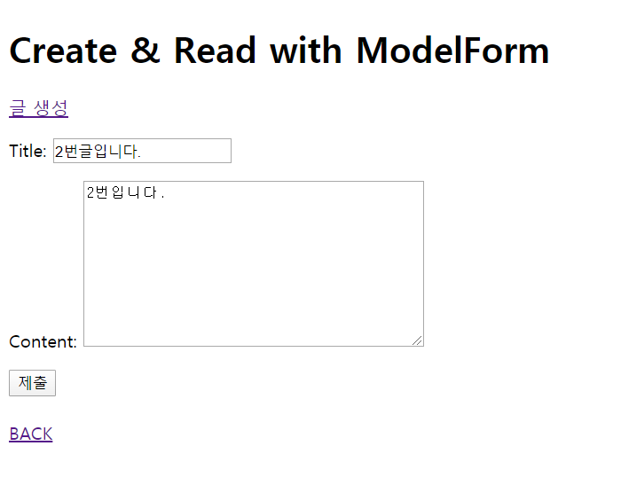

# 0407_workshop

### 1. 코드

#### views.py

```python
def update(request,id):
    article=get_object_or_404(Article,id=id)
    if request.method=='POST':
        form=ArticleForm(request.POST,instance=article)
        if form.is_valid():
            article=form.save()
            return redirect('articles:detail',article.id)

    else:

        form=ArticleForm(instance=article)
    context={
        'form':form,
    }
    return render(request,'articles/update.html',context)

def delete(requst,id):
    article=get_object_or_404(Article,id=id)
    article.delete()
    return redirect('articles:index')
```

#### forms.py

```python
from django import forms
from .models import Article

class ArticleForm(forms.ModelForm):
    class Meta:
        model=Article
        fields='__all__'
```


### 2. 결과 사진


#### UPDATE

