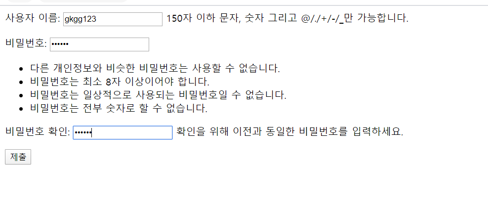
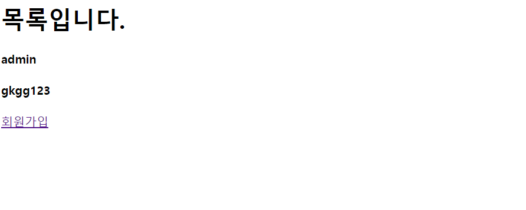

### 0413.workshop

####  1.views.py에 작성한 코드와 각 페이지의 결과 사진을 마크 다운에 작성하여 제출한다.

```python
from django.shortcuts import render,redirect
from django.contrib.auth.forms import UserCreationForm
from django.contrib.aut import get_user_model

# Create your views here.


def index(request):
    User=get_user_model()
    users=User.objects.all()
    context={
        'users':users,
    }
    return render(request,'accounts/index.html',context)

def signup(request):
    if request.method=='POST':
        form=UserCreationForm(request.POST)
        if form.is_valid():
            form.save()
            return redirect('accounts:index')
    else:
        form=UserCreationForm()
    context={
        'form':form,

    }
    return render(request,'accounts/signup.html',context)
```

### 결과화면

#### signup 화면



#### index화면

