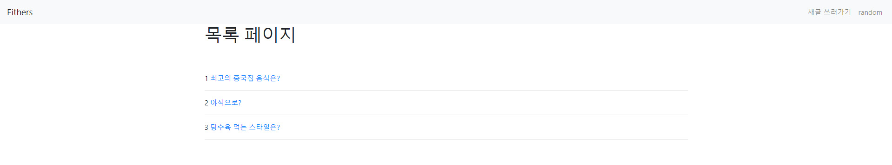

# 0427_workshop


### views.py

```python
from django.shortcuts import render,redirect,get_object_or_404
from .models import Either,Comment
from .forms import EitherForm,CommentForm
import random
# Create your views here.


def index(request):
    eithers=Either.objects.all()
    context={
        'eithers':eithers
    }
    return render(request,'eithers/index.html',context)


def create(request):
    if request.method=='POST':
        form=EitherForm(request.POST)
        if form.is_valid():
            form.save()
            return redirect('eithers:index')
    else:
        form=EitherForm()
    context={
        'form':form
    }
    return render(request,'eithers/form.html',context)


def detail(request,either_id):
    either=get_object_or_404(Either,id=either_id)
    form=CommentForm()
    red_count=either.comment_set.filter(pick='red').count()
    blue_count=either.comment_set.filter(pick='blue').count()
    total=red_count+blue_count
    blue_percent=0
    red_percent=0
    if total:
        red_percent=round(red_count/total*100,2)
        blue_percent=round(blue_count/total*100,2)
    context={
        'either':either,
        'form':form,
        'red_count':red_count,
        'blue_count':blue_count,
        'total':total,
        'red_percent':red_percent,
        'blue_percent':blue_percent,
    }
    return render(request,'eithers/detail.html',context)


def comment_create(request,either_id):
    either=get_object_or_404(Either,id=either_id)
    if request.POST:
        form=CommentForm(request.POST)
        if form.is_valid():
            comment=form.save(commit=False)
            comment.either=either
            comment.save()
            return redirect('eithers:detail',either_id)

def either_random(request):
    either_len=Either.objects.all().count()
    either_list=range(1,either_len+1)
    either_id=random.choice(either_list)
    return redirect('eithers:detail',either_id)

```


### models.py

```python
from django.db import models

# Create your models here.
class Either(models.Model):
    red_option=models.CharField(max_length=100)
    blue_option=models.CharField(max_length=100)
    title=models.CharField(max_length=150)


class Comment(models.Model):
    pick=models.CharField(max_length=100)
    content=models.CharField(max_length=100)
    either=models.ForeignKey(Either,on_delete=models.CASCADE)
```


### 결과 

### index




### detail

