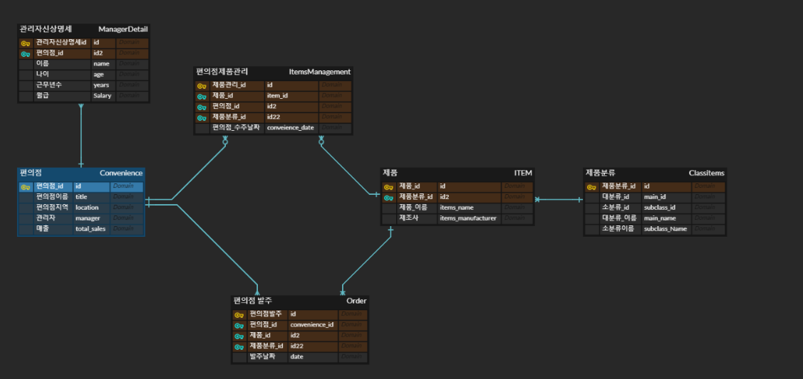

# 0504_workshop


##### 1. ERD




##### 2. models.py

```python
from django.db import models

# Create your models here.

class Convenience(models.Model):
    title=models.CharField(max_length=100) ### 편의점 이름
    location=models.CharField(max_length=100) ### 편의점 지역
    sales=models.IntegerField(default=0)   #### 매출


class ManagerDetail(models.Model): ### 근무자 관련 세부사항
    name=models.CharField(max_length=100)  #### 이름
    age=models.IntegerField() #### 나이
    year=models.IntegerField() ### 근속년수
    salary=models.IntegerField()  ### 월급
    convenience=models.ForeignKey(Convenience,on_delete=models.CASCADE) ### 근무처

class ClassItem(models.Model):
    main_id=models.IntegerField() ### 대분류 관리번호
    subclass_id=models.IntegerField() ### 소분류 관리번호
    main_name=models.CharField(max_length=100)   ### 대분류 이름
    subclass_name=models.CharField(max_length=100) ###  소분류 이름

class Item(models.Model):  ### 제품 관련 클래스
    name=models.CharField(max_length=100) ## 제품이름
    manufacturer=models.CharField(max_length=100)  ## 제조사
    item_class=models.ForeignKey(ClassItem,on_delete=models.CASCADE)  ### 제품 분류
    conveniences_received=models.ManyToManyField(Convenience,  
    through='ItemManageMent',
    related_name='receive_items'
    ) #### 수주관련 
    conveniences_orders=models.ManyToManyField(
        Convenience,
        through='Order',
        related_name='orders_items')
    #### 발주관련

class ItemManageMent(models.Model):  ### 수주 관련 클래스
    item=models.ForeignKey(Item,on_delete=models.CASCADE)
    convenience=models.ForeignKey(Convenience,on_delete=models.CASCADE)
    received_date=models.DateTimeField()  ### 수주 날짜


class Order(models.Model):  ### 발주 관련 클래스
    item=models.ForeignKey(Item,on_delete=models.CASCADE)
    convenience=models.ForeignKey(Convenience,on_delete=models.CASCADE)
    order_date=models.DateTimeField()  ##발주 날짜


```


- 관계 설명
- 먼저 가장 중심축이 되는 편의점 관련 클래스인 `Convenience` 는 `Item` 클래스와  2개의 중계 클래스를 통해,  `M:N` 관계를 구축하였고, 각각의 중계 클래스는 `ItemManageMent`클래스와 `Order`클래스로, 전자는 수주관련 클래스이고, 후자는 발주 관련클래스입니다.
- 그리고 `Item`클래스는 `ClassItem`클래스와 `N:1` 관계를 구축하였습니다.
- `Classitem`는 제품분류를 관리하는것으로서, 제품분류 내에 다양한 아이템이 있는것이기 때문에 `ClassItem`이 1 `Item`클래스를 N으로 설정하였습니다.
- 마지막으로 `ManagerDetail`클래스는 근무자를 나타내는 클래스로, `Conveience`클래스와 `1:N` 관계를 구축하였습니다. 여기서 1은 `Conveience`이고 `ManagerDetail`이 N입니다.