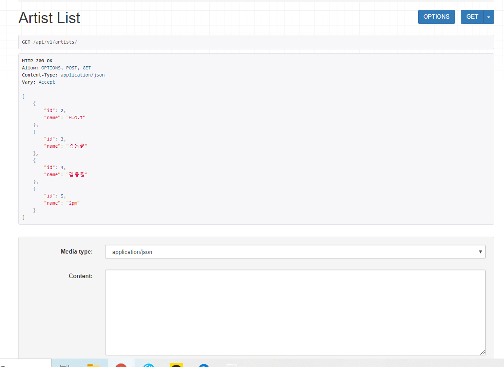
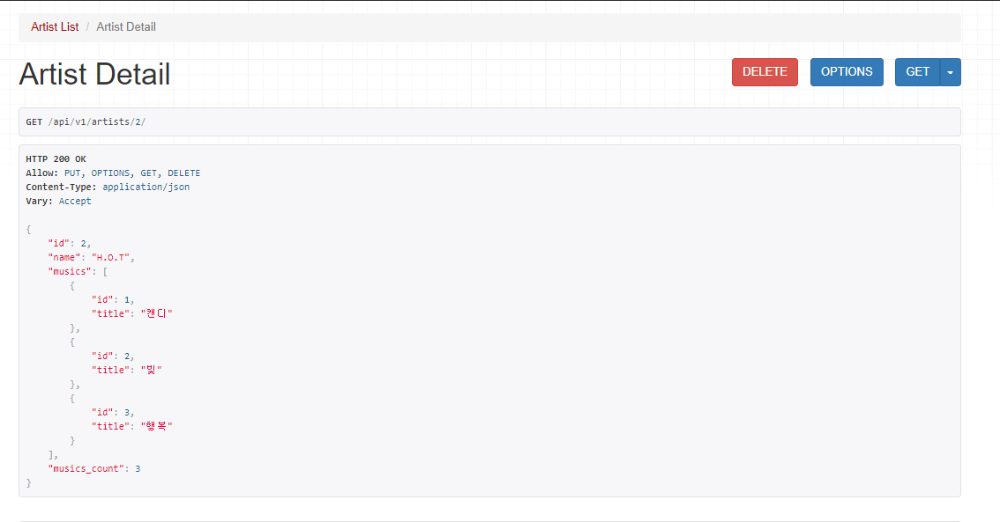
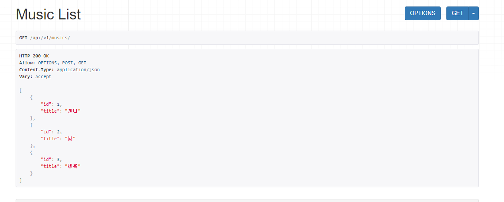
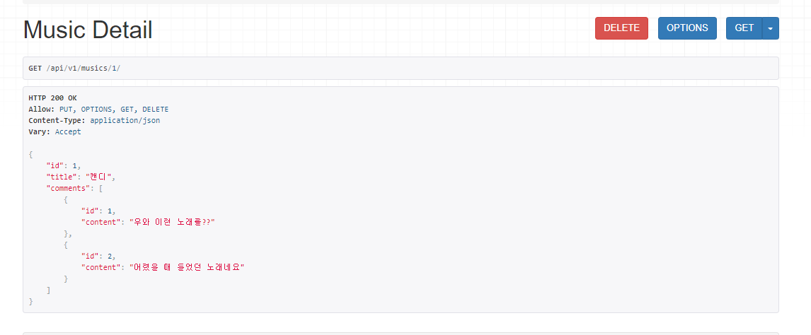

# 0511_workshop


###  views.py

```python
from django.shortcuts import render
from .models import Artist,Music
from rest_framework import status
from .serialzers import ArtistSerializer,ArtistDetailSerializer,MusicSerializer,MusicDetailSerializer
from rest_framework.response import Response
from rest_framework.decorators import api_view
# Create your views here.

@api_view(['GET','POST'])
def artist_list(request):

    if request.method == 'GET':
        artists = Artist.objects.all()
        serializer = ArtistSerializer(artists, many=True)

        return Response(serializer.data)
    elif request.method == 'POST':
        serializer = ArtistSerializer(data = request.data)
        if serializer.is_valid():
            serializer.save()
            return Response(serializer.data)
        return Response(serializer.errors,status=status.HTTP_400_BAD_REQUEST)


@api_view(['GET','PUT','DELETE'])
def artist_detail(request,artist_id):
    if request.method == 'GET':
        artist = Artist.objects.get(id=artist_id)
        serializer = ArtistDetailSerializer(artist)
        return Response(serializer.data)
    elif request.method == 'PUT':
        artist = Artist.objects.get(id=artist_id)
        serializer = ArtistDetailSerializer(artist,data=request.data)
        if serializer.is_valid():
            serializer.save()
            return Response(serializer.data)
    elif request.method == 'DELETE':
        artist = Artist.objects.get(id=artist_id)
        artist.delete()
        return Response(status=status.HTTP_204_NO_CONTENT)


@api_view(['GET','POST'])
def music_list(request):

    if request.method == 'GET':
        musics = Music.objects.all()
        serializer = MusicSerializer(musics, many=True)

        return Response(serializer.data)
    elif request.method == 'POST':
        serializer = MusicSerializer(data = request.data)
        if serializer.is_valid():
            serializer.save()
            return Response(serializer.data)
        return Response(serializer.errors,status=status.HTTP_400_BAD_REQUEST)


@api_view(['GET','PUT','DELETE'])
def music_detail(request,music_id):
    if request.method == 'GET':
        music = Music.objects.get(id=music_id)
        serializer = MusicDetailSerializer(music)
        return Response(serializer.data)
    elif request.method == 'PUT':
        music = Music.objects.get(id=music_id)
        serializer = MusicDetailSerializer(music,data=request.data)
        if serializer.is_valid():
            serializer.save()
            return Response(serializer.data)
    elif request.method == 'DELETE':
        music = Music.objects.get(id=music_id)
        music.delete()
        return Response(status=status.HTTP_204_NO_CONTENT)
```


### serializers.py

```python
from rest_framework import serializers
from .models import Artist,Music,Comment


class ArtistSerializer(serializers.ModelSerializer):
    class Meta:
        model = Artist
        fields = '__all__'


class MusicSerializer(serializers.ModelSerializer):
    class Meta:
        model = Music
        fields = ['id', 'title',]


class ArtistDetailSerializer(serializers.ModelSerializer):
    musics = MusicSerializer(many=True, read_only=True)
    musics_count = serializers.SerializerMethodField(read_only=True)
    def get_musics_count(self,artist):
        return artist.musics.count()

    class Meta:
        model = Artist
        fields = ['id','name','musics','musics_count']

class CommentSerializer(serializers.ModelSerializer):
    class Meta:
        model = Comment
        fields = ['id','content']

class MusicDetailSerializer(serializers.ModelSerializer):
    comments = CommentSerializer(many=True,read_only = True)
    class Meta:
        model = Music
        fields = ['id','title','comments']
```


### 결과 화면

#### 1. artists/




#### 2. artists/<int : artist_id >

​	


#### 3.  musics/




#### 4. musics/<int : music_id>

