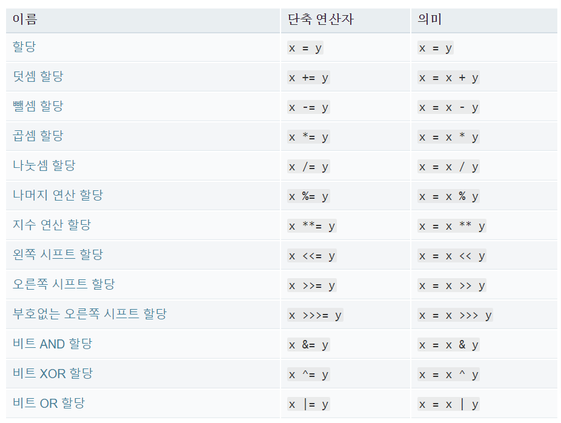
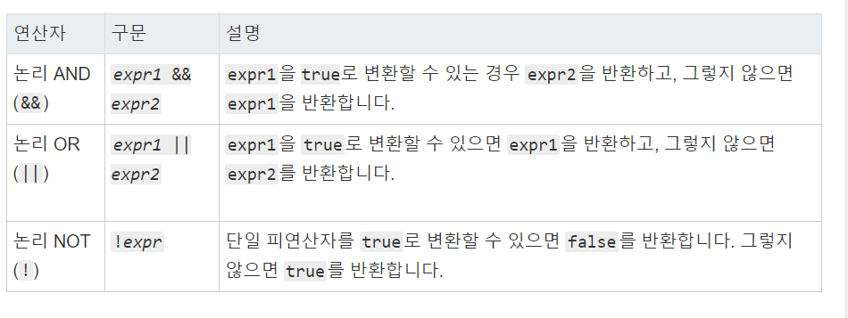

# 0512_exercise

1. 타입과 연산자

   1. Primitive 타입

      1. Number

      2. String

         1. Template Literal

      3. Boolean

      4. Empty Value

         ```javascript
         // 1. Number
         let a = 123
         // 2. String
         let name = 'changwan'
         // 2.1 Template Literal
         let hello_msg = `Hello ${name}`
         // 3. Boolean
         let b = true
         // 4. Empty Value
         let c = ""
         ```

   2.  연산자

      1. 할당 연산자

         

      2. 비교 연산자

      3. 동등 연산자

      4. 일치 연산자

      5. 논리 연산자

         

      6. 삼항 연산자

         ```javascript
         // 1. 할당연산자
         let x = 5
         let y = 10
         x = y
         // 2. 비교 연산자
         2 >= 1
         
         // 3. 동등 연산자
         1 == '1'
         
         // 4. 일치 연산자
         1 === 1
         ///5. 논리 연산자
         true && ture
         true || false
         // 6. 삼항 연산자
         let a = 6
         (a> 5)? "True, over" : "False, under 5";
         ```

2. 조건문과 반복문

   1. 조건문

      1. `if`,`else if` ,`else`

         ```javascript
         let day = 7
         if (day === 1){
             console.log('월요일')
         } else if ( day ===2 ){
             console.log('화요일')
         } else if ( day === 3){
             console.log('수요일')
         } else if ( day === 4){
             console.log('목요일')
         } else if ( day === 5){
             console.log('금요일')
         } else if ( day === 6){
             console.log('토요일')
         } else {
             console.log('일요일')
         }
         ```

      2. `switch`

         ```javascript
         switch (day){
             case 1:
                 console.log('월요일')
                 break;
             case 2:
                 console.log('화요일')
                 break;
             case 3:
                 console.log('수요일')
                 break
             case 4:
                 console.log('목요일')
                 break
             case 5:
                 console.log('금요일')
                 break
             case 6:
                 console.log('토요일')
                 break
             case 7:
                 console.log('일요일')
                 break
         }
         
         ```

   2. 반복문

      1. `while`

         ```javascript
         let num = 0
         while (num <=5){
             console.log(num)
             num++
         }
         ```

      2. `For`

         ```javascript
         for ( let a=0; a<5 ; a++){
             console.log(a)
         }
         ```

      3. `for ... of `

         ```javascript
         for (let number of numbers){
             console.log(number)
         }
         
         ```

      4. `for ... in`

         ```javascript
         for (let fruit in fruits){
             console.log(fruit + ':' + fruits[fruit])
         }
         ///apple:2
         //VM2224:2 banana:10
         //VM2224:2 tomato:10
         //VM2224:2 watermelon:2
         ```

      5. `continue`

         ```javascript
         for (let a = 0; a<10; a++){
             if ( a === 3){
                 continue
             } else {
                 console.log(a)
             }
         }
         ```

3.  함수

   1. 선언식 & 표현식

   2. 기본값 인자

   3. 화살표 함수

      ```javascript
      // 1-1. 선언식
      function hello(){
          console.log('hello')
      }
      
      hello()
      // 1-2. 표현식
      const world = function(){
          console.log('world')
      }
      world()
      // 2.기본값 인자
      const hello = function (a=3){
          return a+5
      }
      console.log(hello())
      VM344:1 8
      console.log(hello(5))
      VM353:1 10
      
      
      // 3. 화살표 함수
      
      const world = (a) =>{
          return a*2
      }
      console.log(world(10))
      VM584:1 20
      ```

4.  자료구조 (Array & Object)

   1. 배열(Array)

      1. 배열의 인덱스 접근

      2. 자주 쓰이는 배열 메서드

         ```javascript
         const numbers = [1,2,3,4,5]
         console.log(numbers[0])
         numbers.push(6)
         numbers.pop()
         numbers.shift()
         numbers.unshift('100')
         
         ```

         

   2. 오브젝트(Object)

      ```javascript
      const me = {
          name: 'change',
          location : 'gj',
          language : ['python','js','sql'],
          product : {
              phone :'iphone',
              computer : 'desktop',
          },
          greeting : function( num ){return num*2},
          double : (num) => {return num*2},
      
      
      }
      console.log(me.name)
      console.log(me["name"])
      ```

   3. Json <-> Object

      1. Object -> Json

      2. Json ->object

         ```javascript
         let meJson = JSON.stringify(me)
         /// json으로 변환
         console.log(meJson)
         let newMe =JSON.parse(meJson)
         /// Object로 다시 변환
         console.log(newMe)
         ```

         

