## Django_PJT1

### 해당 프로젝트의 목표

- 모델 클래스를 만들어, 값을 저장하고 그걸 꺼내는 연습

### 해당 프로젝트의 구현 순서

1. 먼저 `Apps`를 만든뒤 `settings.py`에 초기설정을 해주었다.

   

   ```python 
   python manage.py startapp community
   ```

   위와 같은 명령어를 친뒤 `settings.py`에서

   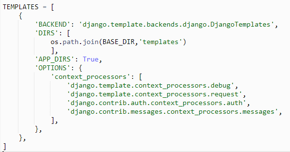

   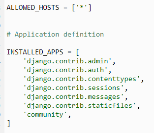

   위와 같이 먼저 초기세팅을 해주었다.

   
   

2.  `Model`을 구현을 해주기 위해, 명세서에 있는 `Review` 클래스를 생성 해줬다.

   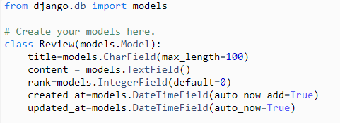

   ​	위와 같이 작성하여 타이핑을 한 후에, 해당 클래스를 DB에 적용해주기 위해

   ```python
   python manage.py makemigrations
   python manage.py migrate
   ```

     명령어를 2개 실행 시켜줬다. 그리고 명세서에는 `title`의 최대길이를 100으로 설정해줘야해서,

   `max_length`을 100으로 만들어줬다.

3. 그리고 `admin.py` 관리자 적용 및 클래스를 적용해주는 작업을 해주었다.
   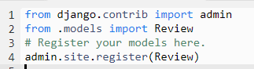

   이렇게 `Review` 클래스를 `admin` 페이지에 적용시켜줬다.

4.  그리고 우리는 `urls.py`를 따로 관리해주기 위하여, 프로젝트의 `urls.py`와 앱에 `urls.py`를 생성해주어 관리해주었다.
   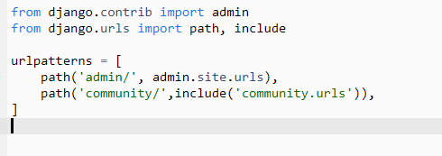

   먼저 프로젝트의 `urls.py`를 이렇게 고쳐주고 난뒤 앱에 `urls.py`를 생성해준뒤 

   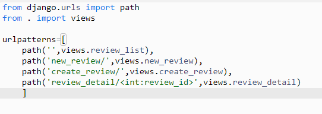

   앱의 `urls.py`를 이렇게 설정해주었다.

5. 위와 같은 작업이 마쳐지면 각 페이지를 구현해주는 작업을 해주면 된다.


### 각 페이지 구현 작업.

- 해당 페이지를 만드는 데 가장 첫 작업이라 생각한 것은 `new_review` 라고 생각했다. 
  그 이유는 여기서는 클래스를 이용해서 값을 저장하고, 그걸 출력하는 과정이므로,
  클래스에 값을 저장하는 작업이 가장 중요하다고 생각했다.

  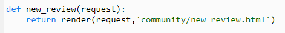

  와 같이 `views.py`를 설정해줬고,

  ```html
  
  
  
  <form class="w-75 d-flex flex-column align-content-center m-auto" action="/community/create_review/">
    <div class="form-group">
      <label for="title">제목</label>
      <input class="form-control" type="text" id="title" name="title" placeholder="제목을 입력하세요." required>
    </div>
    <div class="form-group">
      <label for="exampleFormControlTextarea1">본문을 입력해주세요.</label>
      <textarea class="form-control" id="exampleFormControlTextarea1" rows="30" name="content"></textarea>
    </div>
    <div class="form-group text-center">
        <label for="rank"> 평점을 입력해주세요.(0~10)</label>
        <input class="form-control text-center w-25 m-auto" type="number" min="0" max="10" id="rank" name="rank" required>
    </div>
    <input type="submit" value="작성완료" class="mb-5">
  </form>
  
  
  ```

  각 input마다 나중에 쓰기 위해서 `name`과 `type`을 클래스의 어트리뷰트와 동일시하게 설정해줬다. 그리고 평점을 입력하는 곳에는 무조건 숫자가 들어오고,  `min` `max`값을 0~10까지 설정해주기 위해, 평점이 들어오는 `input`에 `max` `min`과 필수적으로 입력해주기 위해 `required`를 설정해줬다.

- 다음으로 작업한 곳은 `create_review` 항목이었다.

  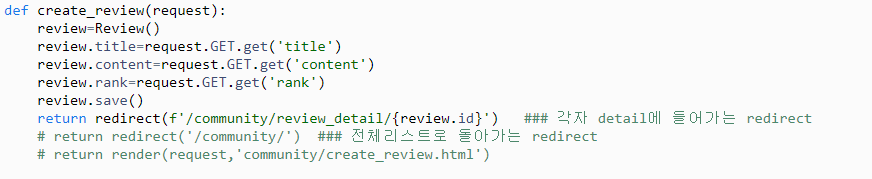

  `create_review`를 하면서 가장 중요했던점은 `new_review`에서 보내준 `request`를 이용하여, 

  `review` 인스턴스를 만들어주고 각각 저장해줬다. 가장 처음에는 가장 쉬운 `create_review.html`으로 이어주는 것을 먼저해줬고, 그 다음에는 가장 첫화면인 `/community`에 리다이렉트를 해줬고, 최종적으로는 `review_detail`주소로 리다이렉트를 해줬다.

- 다음으로 작업한 것은 `review_list` 였다.

  ```python
  def review_list(request):
      reviews=Review.objects.all()
      context={
          'reviews':reviews,
      }
      return render(request,'community/review_list.html',context)
  ```

  

  ```html
  
  
  
  <div class="container mt-5 align-content-center">
      <div class="row">
  <table class="table">
  <thead class="thead-dark">
          <tr>
            <th scope="col">id</th>
            <th scope="col">글제목</th>
            <th scope="col">내용</th>
            <th scope="col">평점</th>
            <th scope="col">작성날짜</th>
          </tr>
        </thead>
        <tbody>
  
      <tr>
        <th scope="row">{{ review.id }}</th>
        <td class="text-truncate" style="max-width: 200px;">  <a href="/community/review_detail/{{ review.id }}" class="text-dark text-decoration-none">{{ review.title }}</a></td>
        <td class="text-truncate" style="max-width: 400px;">{{ review.content }}</td>
        <td>{{ review.rank }}</td>
        <td>{{ review.created_at }}</td>
      </tr>
  
  
    </tbody>
  </table>
  <nav class="offset-4" aria-label="Page navigation example">
              <ul class="pagination m-0">
                <li class="page-item"><a class="page-link" href="#">Previous</a></li>
                <li class="page-item"><a class="page-link" href="#">1</a></li>
                <li class="page-item"><a class="page-link" href="#">2</a></li>
                <li class="page-item"><a class="page-link" href="#">3</a></li>
                <li class="page-item"><a class="page-link" href="#">Next</a></li>
              </ul>
            </nav>
  </div>
  </div>
  
  ```

  `Review.objects.all()`라는 명령어를 통해 클래스에 전부 저장된 정보들을 구해서 저장해줬다. 그리고 그걸 DTL을 이용해 하나하나의 정보를 끄집어내줬다.

-  `Detail_review` 를 구현해줬다. 여기서는 다른 부분보다 viwes.py와 urls.py가 중요했다.

  ```python
  path('review_detail/<int:review_id>',views.review_detail)
  ```

  `variable routing`을 이용해 각각의 화면이 나올수 있도록 해줘야한다.

  ```python
  def review_detail(request,review_id):
      review=Review.objects.get(id=review_id)
      context={
          'review':review,
      }
      return render(request,'community/review_detail.html',context)
  ```

  `review_list`에서 보내준 `review_id`를 이용해서 `Review.objects.get(id=review_id)`를 통해 `id`에 해당되는 정보들만 얻어내서 바로 `review_detail.html`에 보내줬다.

- 그리고 가장 기본이 되는 `base.html`은 

```html
<!DOCTYPE html>
<html lang="ko">
<head>
    <meta charset="UTF-8">
    <meta name="viewport" content="width=device-width, initial-scale=1.0">
    <meta http-equiv="X-UA-Compatible" content="ie=edge">
    <title>Document</title>
    <link rel="stylesheet" href="https://stackpath.bootstrapcdn.com/bootstrap/4.4.1/css/bootstrap.min.css" integrity="sha384-Vkoo8x4CGsO3+Hhxv8T/Q5PaXtkKtu6ug5TOeNV6gBiFeWPGFN9MuhOf23Q9Ifjh" crossorigin="anonymous">
</head>
<body>
    <nav class="navbar navbar-expand-md navbar-dark sticky-top bg-dark py-4">
    <button class="navbar-toggler" type="button" data-toggle="collapse" data-target="#navbarsExample04" aria-controls="navbarsExample04" aria-expanded="false" aria-label="Toggle navigation">
    <span class="navbar-toggler-icon"></span>
    </button>
    <div class="collapse navbar-collapse justify-content-end" id="navbarsExample04" style>
      <ul class="navbar-nav list-unstyled mb-0 ">
        <li class="nav-item active mx-3 font-weight-bold text-black-50 "><a href="/community/" class="text-white text-decoration-none">전체 리뷰 목록 조회</a></li>
        <li class="nav-item mx-3 font-weight-bold text-black-50"><a href="/community/new_review/" class="text-white text-decoration-none">새로운 리뷰 작성 페이지</a></li>
      </ul>
    </div>
</nav>

    
    

    <script src="https://code.jquery.com/jquery-3.4.1.slim.min.js" integrity="sha384-J6qa4849blE2+poT4WnyKhv5vZF5SrPo0iEjwBvKU7imGFAV0wwj1yYfoRSJoZ+n" crossorigin="anonymous"></script>
    <script src="https://cdn.jsdelivr.net/npm/popper.js@1.16.0/dist/umd/popper.min.js" integrity="sha384-Q6E9RHvbIyZFJoft+2mJbHaEWldlvI9IOYy5n3zV9zzTtmI3UksdQRVvoxMfooAo" crossorigin="anonymous"></script>
    <script src="https://stackpath.bootstrapcdn.com/bootstrap/4.4.1/js/bootstrap.min.js" integrity="sha384-wfSDF2E50Y2D1uUdj0O3uMBJnjuUD4Ih7YwaYd1iqfktj0Uod8GCExl3Og8ifwB6" crossorigin="anonymous"></script>
</body>
</html>
```

으로 하여 `nav`바를 구현해줬다.


### 결과 화면 

#### review_list 화면

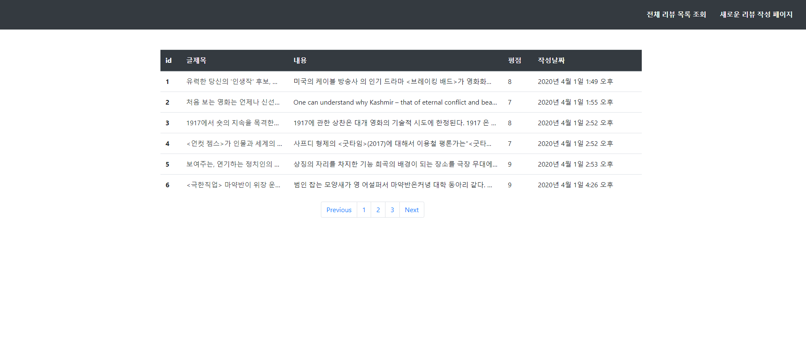

#### new_list 화면

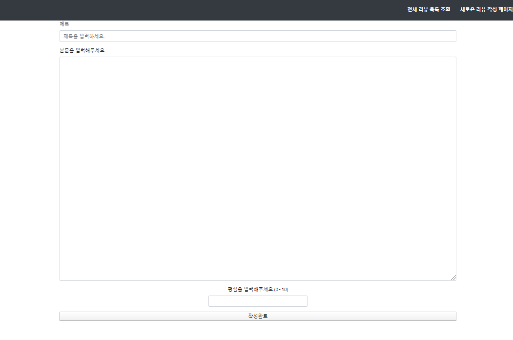

### Detail_review 화면

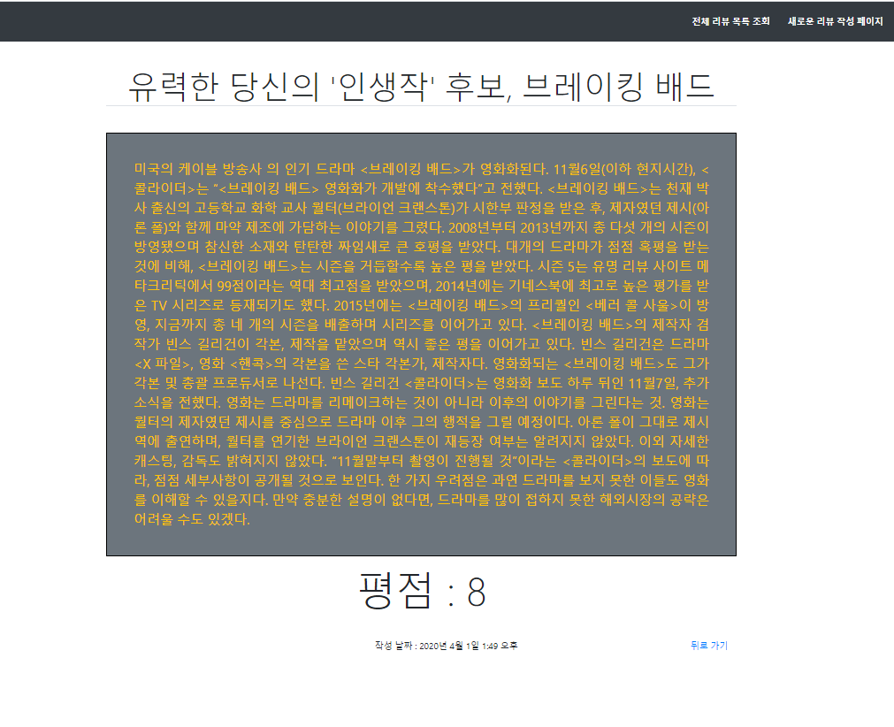

#### 어려웠던 점

- 해당 프로젝트를 진행하면서 어려웠던 점은 순서가 가장 중요했다는 것이다.
- 프로젝트를 만들때 어떤 순서로 진행을 해야하는지 차근차근 진행하는 것이 힘들었고, 어떤 부분부터 먼저 만들어놔야하는지 중요했다.
- 그래서 저는 각 우선순위를 정해, 먼저 만들어야하는 화면부터 차근차근 진행했고, 다음화면으로 넘어갈때 defalut 값을 넣어 제대로 주소가 옮겨갔는지 확인을 해준뒤 그 뒤에 하나하나씩 고쳐가는 작업을 했다.
- 