# README

### Django_pjt3

### 1. 구현과정

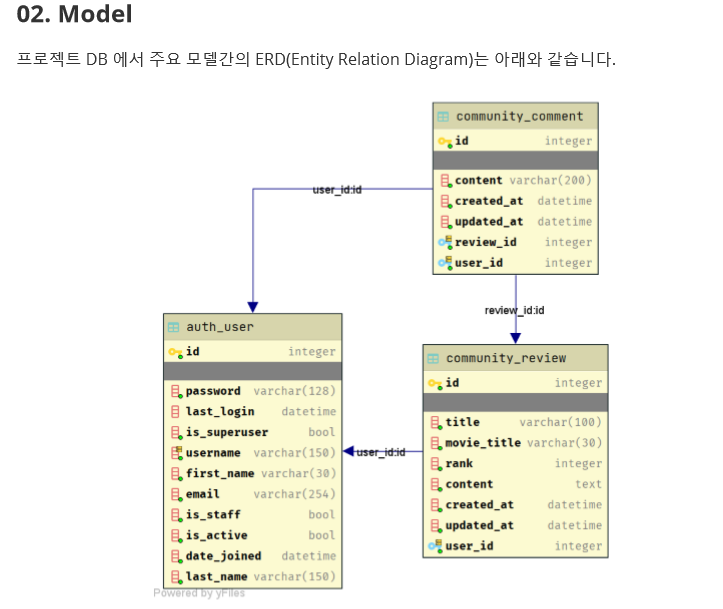

- 해당 명세서 주어진 모델이 다음과 같았다. 여기서 `review`,`comment` 모델 같은경우에는 종속되어진 상위모델이 있어서, 먼저 구현할시 `makemigrations`나 `migrate`를 하는데 문제가 생길것이라 판단하였다.
- 그래서 먼저 우리는 `User`모델을 만든뒤 그와 관련된 함수들을 완성하고, 그 다음에 `Review`모델을 만든뒤, 
  그와 관련된 함수들을 만들어 줬다. 두개가 완성된 뒤에는 최종적으로 `comment`모델을 만들어줬고, 그와 관련된 함수들을 만드는 과정을 진행하였다.


### 2. Accounts 앱 만들기 (User model을 활용한 계정 생성 및 로그인, 로그아웃 구현)

#### 2.1 회원가입 

- <h3>accounts/views.py

  ```python
  from django.shortcuts import render,redirect
  from django.contrib.auth.forms import UserCreationForm
  from django.contrib.auth import login as auth_login
  from django.contrib.auth import authenticate
  
  def signup(request):
      if request.user.is_authenticated:
          return redirect('community:review_list')
      else:
          if request.method == "POST":
              form = UserCreationForm(request.POST)
              if form.is_valid():
                  new_user=form.save()
                  authenticated_user=authenticate(username=new_user.username,password=request.POST['password1'])
                  auth_login(request,authenticated_user)
                  return redirect('community:review_list')
          else:
              form = UserCreationForm()
          context = {
              'form':form
          }
          return render(request, 'accounts/signup.html',context)
  
  ```

- 다음과 같이 회원작업을 해주었다. 먼저 사용자가 로그인 된 상태라면, 전체리뷰 게시판으로 리다이렉트를 시켜주었다. 

- 만약 인증된 사용자가 아닐시, 빈 폼을 제공해주고, 사용자가 작성한 폼에서 정보를 추출하여, User를 만들어줬다.

- 여기서 어려웠던점은 회원가입 후 바로 로그인을 하는작업이었다. 그래서 `authenticate`라는 모듈을 이용하여, 로그인 작업을하였다. `AuthenticationForm`으로 만들어진 경우 관련 메소드로 `get_user()`를 이용하여, `user`의 정보를 가져올수 있었다. 하지만 여기에서는 `AuthenticationForm`이 없어서, `authenticate`라는 메소드를 이용해, 사용자의 `username`과 `password`를 끄집어내 직접적으로 인증작업을 해주고, 그 인증된 유저 정보를 `auth_login`함수에 넣어줘서 로그인상탵로 만들어줬다.

- <h3> accounts/signup.html
      
  </h3>

  ```html
  
  
  <div class="my-5" style="border:1px solid black">
      <div class="h1 text-center my-5">회원가입</div>
  <form action="" method="POST">
      
      <div class="mx-5">{{ form.as_p }}
      </div>
          <div class="d-flex justify-content-center">
      <button class="btn btn-primary px-5 my-5" type="submit">회원가입</button>
      </div>
  </form>
  </div>
  
  ```

- <h3>회원가입화면 결과

  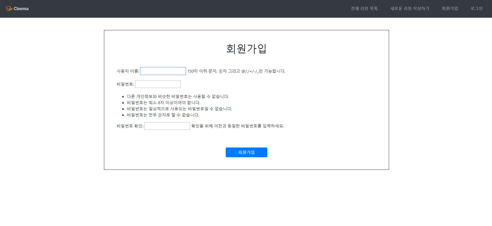


#### 2.2 로그인

- <h3>accounts/views.py</h3>

  ```python
  from django.shortcuts import render,redirect
  from django.contrib.auth.forms import AuthenticationForm
  from django.contrib.auth import login as auth_login
  
  def login(request):
      if request.user.is_authenticated:
          return redirect('community:review_list')
      else:
          if request.method == "POST":
              form = AuthenticationForm(request,request.POST) #
              if form.is_valid():
                  auth_login(request,form.get_user())
                  return redirect(request.GET.get('next') or 'community:review_list') 
          else:
              form = AuthenticationForm()
          context={
              'form':form
          }
          return render(request,'accounts/login.html',context)
  ```

- `login`함수는 `auth_login` ,`AuthenticationForm` 모듈을 이용하여 구현하였다. 사용자에게 `username`과 `password`의 정보를 입력할수 있는 `AuthenticationForm`을 제공해주었다.

- 사용자가 정보를 전부 입력하면, `AuthenticationForm`을 이용하여, 사용자를 인증하는과정을 거치게 되는데,여기서 주의할점은 `ModelForm`이 아니기 때문에 2개의 입력을 받는다.

- 인증작업이 끝나고 난뒤에 `get_user()`메소드를 이용해 유저정보를 가지고 로그인을 한다.

- 마지막으로 `redirect`를 해주게 되는데 여기서 주의할점은 `request.GET.get('next')`를 이용하여, `login_required`데코레이터를 통해 로그인 함수에 오게된 사용자를 원래페이지로 보내주는 역할을 한다.


- <h3>accounts/login.html

  ```html
  
  
  
  
  <div class="mt-5 justify-content-center" style="border:1px solid black">
  
      <h1 class="text-center my-5">로 그 인</h1>
  <form action="" method="POST">
      
      <div class="d-flex mx-auto my-5 justify-content-center">
          <div class="mx-5">사용자 이름 : </div> <div class="mx-5">{{ form.username}}</div>
      </div>
      <div class="d-flex mx-auto my-5 justify-content-center">
          <div class="mx-5">비밀 번호 :</div>   <div class="mx-5">{{ form.password}}</div>
      </div>
      <div class="d-flex justify-content-center">
      <button class="btn btn-primary px-5 my-5" type="submit">로그인</button>
      </div>
  </form>
  </div>
  
  
  
  ```


- <h3>로그인 화면 결과


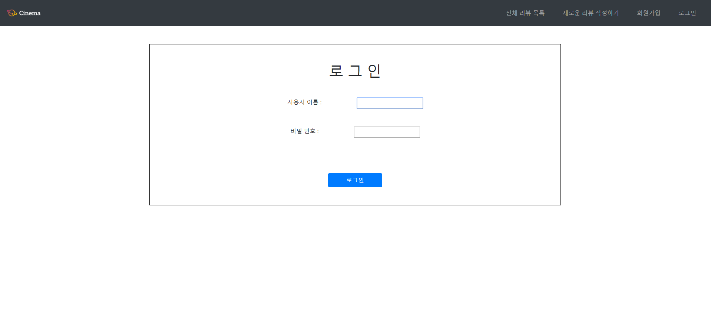

#### 2.3 로그아웃 

- <h3> accounts/views.py

  ```python
  from django.contrib.auth import logout as auth_logout
  from django.contrib.auth.decorators import login_required
  
  @login_required
  def logout(request):
      if request.user.is_authenticated:
          auth_logout(request)
      return redirect('community:review_list')
  ```

- `logout`은 `login`과 비슷하게 `auth_logout`을 이용하여,  로그아웃을 해주었다. 여기서 `@login_required`라는 데코레이터를 이용해, 로그인이 되어있어야지만 접속이 가능하게 해주었고, 밑에서 한번더 `is_authenticated`를 이용하여 검증작업을 한번 더 해주었다.


### 3. Community 앱의 Review 만들기

> ​	앞선 User 모델을 전부 완성시켰기 때문에, 하위모델인 Review를 만들었다. 여기서 통상적인 과정을 같지만, User를 FK로 쓰기 때문에 몇몇부분이 바뀌어진것을 제외하고는 같다.

#### 3.1 Review model을 정의하기

- <h3>community/models.py

  ```python
  from django.db import models
  from django.conf import settings
  # Create your models here.
  class Review(models.Model):
      title=models.CharField(max_length=100)
      movie_title=models.CharField(max_length=30)
      rank=models.IntegerField(default=0)
      content=models.TextField()
      created_at=models.DateTimeField(auto_now_add=True)
      updated_at=models.DateTimeField(auto_now=True)
      user=models.ForeignKey(settings.AUTH_USER_MODEL,on_delete=models.CASCADE)
  ```

- 여기서 전과 달라진점은 `user`를 `FK`로 쓴다는 점이다. `User`는 다른 클래스와 다르게, `settings`안에 있으니 불러오는데 주의하면 된다.

- 여기서 `FK`를 쓸때 주의할점은 `FK`를 저장하는 변수의 이름은 `FK`를 쓸려는 클래스명을 소문자로 적어주는 것이다.

- 장고에서의 `FK`는 자동적으로 저장된 변수의 `_id`를 붙여 새로운 칼람을 만들기때문에 주의해줘야한다.


- <h3>community/forms.py</h3>

  ```python
  from django import forms
  from .models import Review
  
  class ReviewForm(forms.ModelForm):
      title = forms.CharField(
              label='제목',
              help_text='',
              widget=forms.TextInput(
                      attrs={
                          'class': 'w-100 ',
                          'placeholder': '제목 입력'
                      }
                  )
          )
      content = forms.CharField(
              label='내용',
              help_text='자유롭게 작성해주세요.',
              widget=forms.Textarea(
                      attrs={
                          'class':'w-100',
                      }
                  )
          )
      movie_title = forms.CharField(
              label='영화제목',
              widget=forms.TextInput(
                      attrs={
                          'class':'w-100',
                      }
                  )
          )
      rank = forms.CharField(
              label='별점',
              widget=forms.NumberInput(
                      attrs={
                          'class':'w-100',
                          'max':'10',
                          'min':'0'}
                  )
          )
      class Meta:
          model=Review
          fields=['title','movie_title','rank','content']
  ```

- `forms`도 평소와는 같다 하지만 주의해야할점은 과거에는 `fiels`의 값으로 `'__all__'`을 넣어줬는데, 여기서는 자동생성되는 `created_at`,`updated_at` 과 `FK`인 `user` 값을 넣어주지 않는다.


- <h3>community/views.py

```python
from django.shortcuts import render,redirect,get_object_or_404
from .forms import ReviewForm, CommentForm
from .models import Review, Comment
from django.contrib.auth.decorators import login_required
from django.views.decorators.http import require_POST
# Create your views here.


### 전체 리스트 ####
def review_list(request):
    reviews=Review.objects.order_by('-id')
    context={
        'reviews':reviews
    }
    return render(request,'community/review_list.html',context)

### CREATE#####
@login_required
def review_create(request):
    if request.method == 'POST':
        form=ReviewForm(request.POST)
        if form.is_valid():
            review=form.save(commit=False)
            review.user=request.user
            review.save()
            return redirect('community:review_list')
    else:
        form=ReviewForm()
    context={
        'form':form
    }
    return render(request,'community/form.html',context)


#### DETAIL #####
def review_detail(request,review_id):
    review=get_object_or_404(Review,id=review_id)
    form=CommentForm()
    context={
        'review':review,
        'form':form,
    }
    return render(request,'community/review_detail.html',context)


#### UPDATE #####
@login_required
def review_update(request,review_id):
    review=get_object_or_404(Review,pk=review_id)
    if request.user == review.user:
        if request.method=='POST':
            form = ReviewForm(request.POST,instance=review)
            if form.is_valid():
                form.save()
                return redirect('community:review_detail',review_id)
        else:
            form = ReviewForm(instance=review)

        context={
            'form':form
        }
        return render(request,'community/form.html',context)
    else:
        return redirect('community:review_detail',review_id)

    
    
#### DELETE #####
@require_POST
@login_required
def review_delete(request,review_id):
    if request.method=='POST':
        review = get_object_or_404(Review,pk=review_id)
        if request.user == review.user:
            review.delete()
            return redirect('community:review_list')
        else:
            return redirect('community:review_detail',review_id)
```

- `Review`를 이용한 `CRUD` 작업을 전부 해주었다.

- 여기서 주의해야했던점은 `C`였다. 그전에는 그냥 `ModelForm`을 보내주고, 그대로 받아서 저장하면 됬지만 , 여기서는 `FK`가 생겼기 때문에, 따로 저장을 해주어야한다.

- 그래서 기존에 `form.save()`를 했던것을 `review= form.save(commit=False)`를 해주어, 변수에는 값을 저장하지만, DB에는 아직 반영이 안된 상태를 만들어준다. 

- 그렇게 저장된 `review`라는 변수에서 `reviews.user = request.user`를 해주어, `user`정보도 들어갈수 있게 해준다. 그런뒤 `review.save()`를 하여 DB에 반영을 해준다.

  

  ```python
  review=get_object_or_404(Review,pk=review_id)
  if request.user == review.user:
  ```

- 또 조심해야했던 점은 `Update`와 `Delete`를 할때 글을 쓴 작성자와 로그인한 작성자가 맞는지 다시한번 검증작업을 해주어야한다.


- <h3> community/review_list.html

```html



<div id="carouselExampleControls" class="carousel slide mt-2" data-ride="carousel">
  <div class="carousel-inner">
    <div class="carousel-item active">
      
    </div>
    <div class="carousel-item">
      
    </div>
    <div class="carousel-item">
      
    </div>

    <div class="carousel-item">
      
    </div>


    <div class="carousel-item">
      
    </div>
  </div>


  <a class="carousel-control-prev" href="#carouselExampleControls" role="button" data-slide="prev">
    <span class="carousel-control-prev-icon" aria-hidden="true"></span>
    <span class="sr-only">Previous</span>
  </a>
  <a class="carousel-control-next" href="#carouselExampleControls" role="button" data-slide="next">
    <span class="carousel-control-next-icon" aria-hidden="true"></span>
    <span class="sr-only">Next</span>
  </a>
</div>


<div class="text-center h1 col-6 offset-3 mt-5 mb-5" style="border-bottom: 2px solid">영화 리뷰 게시판</div>

<table class="table mx-auto table-bordered mt-5">
  <thead class="thead-light">
    <tr>
      <th scope="col" class="text-center">번호</th>
      <th scope="col" class="text-center">영화제목</th>
      <th scope="col" class="text-center">글 제목</th>
      <th scope="col" class="text-center">작성시간</th>
      <th scope="col" class="text-center">작성자</th>
    </tr>
  </thead>
  <tbody>

    
        <tr>
          <th scope="row" class="text-center">{{ forloop.revcounter }}</th>
          <td>{{ review.movie_title }}</td>
          <td><a href="" class="text-dark text-decoration-none ">{{ review.title }}</a></td>
          <td>{{ review.created_at }}</td>
        <td>{{ review.user.username }}</td>
        </tr>

    
      </tbody>
</table>

<div class="text-right my-5"><a href="" class="h2 text-decoration-none text-dark">글 작성하러가기</a></div>



```


- <h3> community/form.html

```html






    <div class="my-5 text-center h1">새글 쓰기</div>

    <div class="my-5 text-center h1">글 수정하기</div>


<form action="" method='POST'>
    
    {{ form }}

    <button> 작성완료 </button>

</form>



```

-  Form은 `Create`와 `Update`를 구분하여, 다른 문구가 나오도록 설정해주었다.

- <h3> community/review_detail.html

```html





    <div class="text-center h1 col-6 offset-3 mt-5 mb-5" style="border-bottom: 2px solid">영화 리뷰 게시판</div>
    <div class="row justify-content-center border">
        <div class="h4 text-center border-bottom col-8 offset-2 my-5 mx-0 px-0">{{ review.title }}</div>
        <div class="h4 text-center border-bottom col-8 offset-2 mb-5 mx-0 px-0">작성자 : {{ review.user }}</div>
        <p class="col-12 text-justify py-5 px-5 text-warning" style=" border:solid 1px black;font-size:1rem">
            {{review.content}}
        </p>
        <div class="col-12 h4 text-center">
            평점 : {{ review.rank }}
        </div>

        <div class="offset-4 col-8 text-right mt-5">
           <p> 작성 날짜 : {{ review.created_at}} </p>
        </div>
        <div class="offset-4 col-8 text-right">
           <p> 수정 날짜 : {{ review.updated_at}} </p>
        </div>

            
                <div class="d-flex justify-content-end col-12">
        <form action="" class="mx-5 my-5">
            <input type="submit" value="수정">
        </form>
        <form action="" method="POST" class="mx-5 my-5">
            
            <input type="submit" value="삭제">
        </form>
        </div>
    

<div class="col-12 mb-5">
<form action="" method="POST">
    
    {{ form.as_p }}
    <input type="submit" value="댓글 작성">
</form>
</div>

<hr>

    <div class="border border-dark col-12 row my-2">
    <div class="col-2 py-2">댓글내용</div> <div class="col-3 py-2">: {{comment.content}}</div>
    <div class="col-3 py-2">작성자 : {{comment.user.username}}</div>
    <div class="col-4 py-2">
    
    <form action="" method="POST">
        
        <input type="submit" value="삭제">
    </form>
    
    </div>
    </div>




```

- Detail 페이지에서는 다양한 정보들이 많은데, 여기서는 사용자가 로그인을 했을때 보여지는것과 안보여지는것들을 `BTL`을 이용해 다 구현을 해놓았다.


- <h3> 결과 전체 리뷰 화면

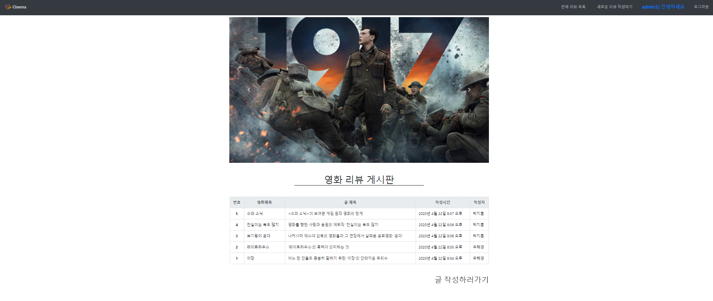

- <h3> 글 작성하기</h3>

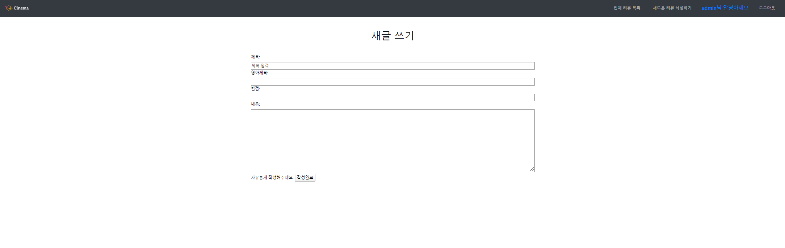

- <h3>리뷰 상세보기 

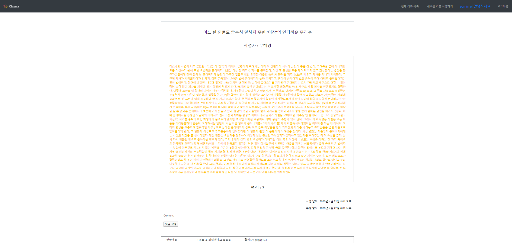


- <h3> 글 수정하기

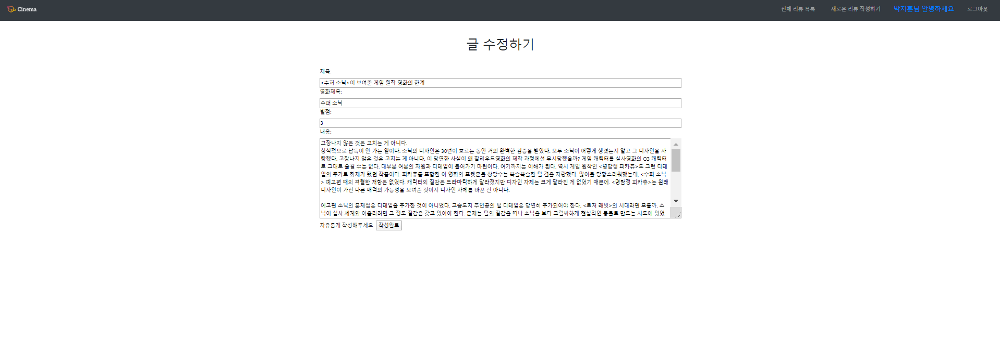


- 글작성자에 따른 수정, 삭제 버튼 활성화 및 비활성화

  - 글 작성자 비로그인 ( 비 활성화)

    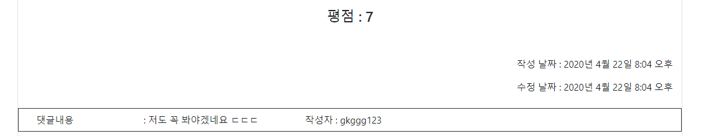

  - 글 작성자 로그인 (활성화)

  - 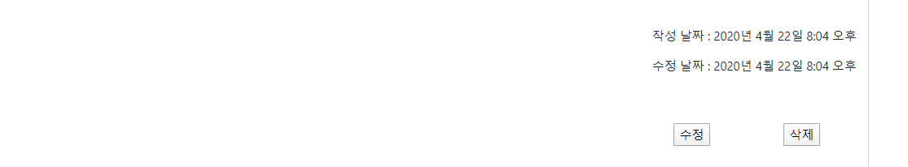

#### 3.2 Comment model을 정의하기 

- <h3> community/models.py

```python
class Comment(models.Model):
    user=models.ForeignKey(settings.AUTH_USER_MODEL,on_delete=models.CASCADE)
    review=models.ForeignKey(Review,on_delete=models.CASCADE)
    content=models.CharField(max_length=200)
    created_at=models.DateTimeField(auto_now_add=True)
    updated_at=models.DateTimeField(auto_now=True)

```

- <h3>community/forms.py

```python
from django import forms
from .models import Review,Comment

class CommentForm(forms.ModelForm):
    class Meta:
        model=Comment
        fields=['content',]
```

- <h3>community/views.py

```python
@login_required
def comments_create(request,review_id):
    review = get_object_or_404(Review, pk=review_id)
    if request.method=='POST':
        form = CommentForm(request.POST)
        if form.is_valid():
            comment = form.save(commit=False)
            comment.review = review
            comment.user=request.user
            comment.save()
    return redirect('community:review_detail',review_id)

@login_required
def comments_delete(request,review_id,comment_id):
    comment=get_object_or_404(Comment,id=comment_id)
    if request.user == comment.user:
        if request.method=='POST':

            comment.delete()
            return redirect('community:review_detail', review_id)
    else:
        return redirect('community:review_detail', review_id)
```

- `Review`모델과 전반적으로 다를것은 없다 단지 `FK`가 2개인것 제외하고는 거의 동일하다고 보면된다.
- `comment`도 `review`와 같이 작성자와 로그인한자와 같은지 다시 한변 판별해서, 함수를 시행하도록 했다.


- <h3> 로그인 상태에 따른 댓글 활성화 , 댓글작성자 유무에 따른 버튼 활성화,비활성화</h3>

  - 로그인 상태

    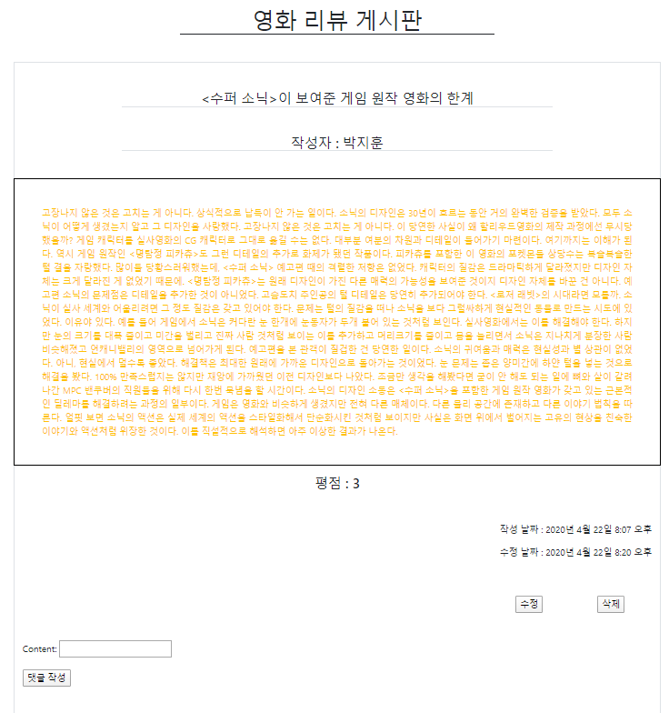

  - 비로그인상태

    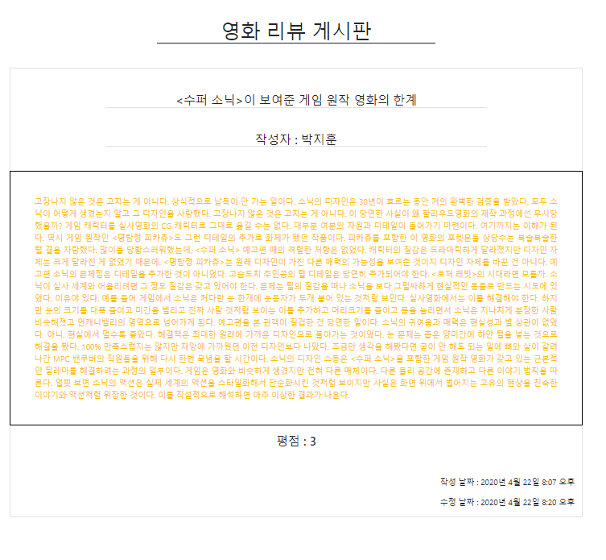

  - 댓글 사용자 삭제 버튼 활성화

    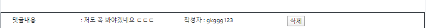

    -

  - 댓글 사용자 삭제 버튼 비활성화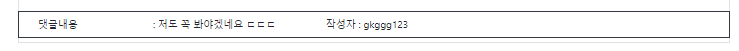

#### 3.3 admin 등록

- <h3>community/admin.py

```python
from django.contrib import admin
from .models import Review,Comment
# Register your models here.


class ReviewAdmin(admin.ModelAdmin):
    list_display=('title','content','created_at','updated_at','user')

class CommentAdmin(admin.ModelAdmin):
    list_display=('content','created_at','updated_at','user')

admin.site.register(Review,ReviewAdmin)
admin.site.register(Comment,CommentAdmin)

```

- 결과 
- Comment
- 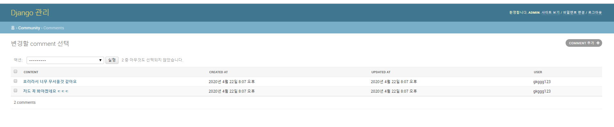
- Review

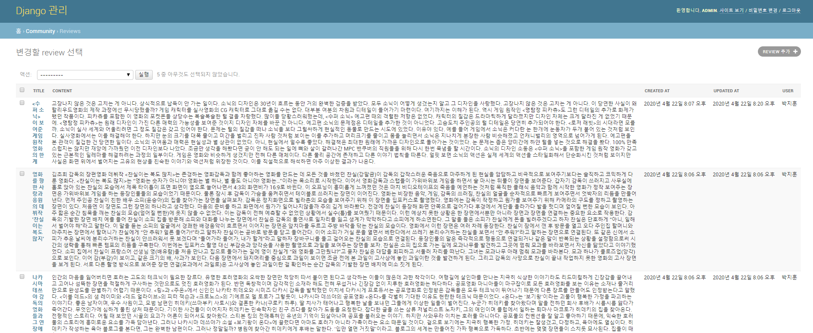


### Apendix 

- <h3> base.html

```html

<!DOCTYPE html>
<html lang="ko">
<head>
    <meta charset="UTF-8">
    <meta name="viewport" content="width=device-width, initial-scale=1.0">
    <meta http-equiv="X-UA-Compatible" content="ie=edge">
    <link rel="stylesheet" href="">
    <title>Document</title>
</head>
<body>
    <nav class="navbar navbar-expand-md navbar-dark sticky-top bg-dark">
      <a class="navbar-brand" href="">
        
      </a>
      <button class="navbar-toggler" type="button" data-toggle="collapse" data-target="#navbarsExample04" aria-controls="navbarsExample04" aria-expanded="false" aria-label="Toggle navigation">
      <span class="navbar-toggler-icon"></span>
      </button>
      <div class="collapse navbar-collapse justify-content-end" id="navbarsExample04" style>
        <ul class="navbar-nav list-unstyled mb-0 ">
        <li class="nav-item mx-3 my-2 "><a href="" class="nav-link">전체 리뷰 목록</a></li>
        <li class="nav-item mx-3 my-2 "><a href="" class="nav-link">새로운 리뷰 작성하기</a></li>
       
            <li class="nav-item mx-3 my-2 h5 text-center py-2 text-primary "> {{ request.user.username }}님 안녕하세요 </li>
            <li class="nav-item mx-3 my-2 "><a href="" class="nav-link" >로그아웃</a></li>
        
            <li class="nav-item mx-3 my-2 "><a href=""  class="nav-link">회원가입</a></li>
            <li class="nav-item mx-3 my-2 "><a href=""  class="nav-link">로그인</a></li>
        

        </ul>
      </div>
  </nav>
    <div class="container">
    
    
    </div>
    <script src="https://code.jquery.com/jquery-3.4.1.slim.min.js" integrity="sha384-J6qa4849blE2+poT4WnyKhv5vZF5SrPo0iEjwBvKU7imGFAV0wwj1yYfoRSJoZ+n" crossorigin="anonymous"></script>
    <script src="https://cdn.jsdelivr.net/npm/popper.js@1.16.0/dist/umd/popper.min.js" integrity="sha384-Q6E9RHvbIyZFJoft+2mJbHaEWldlvI9IOYy5n3zV9zzTtmI3UksdQRVvoxMfooAo" crossorigin="anonymous"></script>
    <script src="" ></script>
</body>
</html>
```

- ```html
     
          <li class="nav-item mx-3 my-2 h5 text-center py-2 text-primary "> {{ request.user.username }}님 안녕하세요 </li>
          <li class="nav-item mx-3 my-2 "><a href="" class="nav-link" >로그아웃</a></li>
      
          <li class="nav-item mx-3 my-2 "><a href=""  class="nav-link">회원가입</a></li>
          <li class="nav-item mx-3 my-2 "><a href=""  class="nav-link">로그인</a></li>
      
  ```

-  이 부분을 통해, 사용자가 로그인 되어있는지 안되어있는지를 구분하여, 로그인,회원가입 과 로그아웃을 구분해서 navbar에 제공해주었다.

- 또한 static을 이용하여, bootstrap을 적용시켜주었다.


#### 폴더 구조

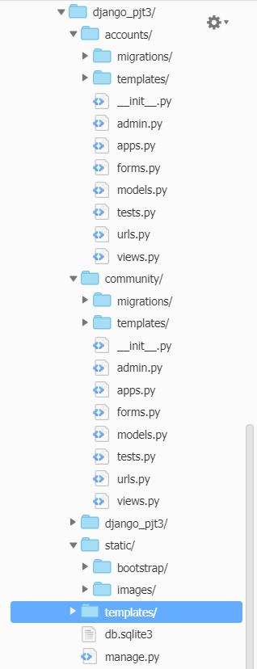


#### settings.py

```python
"""
Django settings for django_pjt3 project.

Generated by 'django-admin startproject' using Django 2.1.15.

For more information on this file, see
https://docs.djangoproject.com/en/2.1/topics/settings/

For the full list of settings and their values, see
https://docs.djangoproject.com/en/2.1/ref/settings/
"""

import os

# Build paths inside the project like this: os.path.join(BASE_DIR, ...)
BASE_DIR = os.path.dirname(os.path.dirname(os.path.abspath(__file__)))


# Quick-start development settings - unsuitable for production
# See https://docs.djangoproject.com/en/2.1/howto/deployment/checklist/

# SECURITY WARNING: keep the secret key used in production secret!
SECRET_KEY = 'p99lr(x#lykrj2^=z*qk*0aa1*4dm1x#&3ru4v983*q8w7-wz&'

# SECURITY WARNING: don't run with debug turned on in production!
DEBUG = True

ALLOWED_HOSTS = ['*']


# Application definition

INSTALLED_APPS = [
    'django.contrib.admin',
    'django.contrib.auth',
    'django.contrib.contenttypes',
    'django.contrib.sessions',
    'django.contrib.messages',
    'django.contrib.staticfiles',
    'accounts',
    'community',
]

MIDDLEWARE = [
    'django.middleware.security.SecurityMiddleware',
    'django.contrib.sessions.middleware.SessionMiddleware',
    'django.middleware.common.CommonMiddleware',
    'django.middleware.csrf.CsrfViewMiddleware',
    'django.contrib.auth.middleware.AuthenticationMiddleware',
    'django.contrib.messages.middleware.MessageMiddleware',
    'django.middleware.clickjacking.XFrameOptionsMiddleware',
]

ROOT_URLCONF = 'django_pjt3.urls'

TEMPLATES = [
    {
        'BACKEND': 'django.template.backends.django.DjangoTemplates',
        'DIRS': [
            os.path.join(BASE_DIR,'templates')
            ],
        'APP_DIRS': True,
        'OPTIONS': {
            'context_processors': [
                'django.template.context_processors.debug',
                'django.template.context_processors.request',
                'django.contrib.auth.context_processors.auth',
                'django.contrib.messages.context_processors.messages',
            ],
        },
    },
]

WSGI_APPLICATION = 'django_pjt3.wsgi.application'


# Database
# https://docs.djangoproject.com/en/2.1/ref/settings/#databases

DATABASES = {
    'default': {
        'ENGINE': 'django.db.backends.sqlite3',
        'NAME': os.path.join(BASE_DIR, 'db.sqlite3'),
    }
}


# Password validation
# https://docs.djangoproject.com/en/2.1/ref/settings/#auth-password-validators

AUTH_PASSWORD_VALIDATORS = [
    {
        'NAME': 'django.contrib.auth.password_validation.UserAttributeSimilarityValidator',
    },
    {
        'NAME': 'django.contrib.auth.password_validation.MinimumLengthValidator',
    },
    {
        'NAME': 'django.contrib.auth.password_validation.CommonPasswordValidator',
    },
    {
        'NAME': 'django.contrib.auth.password_validation.NumericPasswordValidator',
    },
]


# Internationalization
# https://docs.djangoproject.com/en/2.1/topics/i18n/

LANGUAGE_CODE = 'ko-kr'

TIME_ZONE = 'Asia/Seoul'

USE_I18N = True

USE_L10N = True

USE_TZ = True


# Static files (CSS, JavaScript, Images)
# https://docs.djangoproject.com/en/2.1/howto/static-files/

STATIC_URL = '/static/'
STATICFILES_DIRS = (
    os.path.join(BASE_DIR, "static"),
)
```


## 이번 프로젝트를 하면서 어려웠던 점과 배웠던 점

- 이번 프로젝트는 여태까지 배운 CRUD와 Accounts를 연결하여 구현한 것이다.
- 하나만을 작성할때는 몰랐지만, 2개이상의 앱을 이용하고, 2개이상의 모델을 동시에 활요하다보니 처음에 명세서를 보고, 정확한 청사진을 깔지 않으면 중간중간에, 오류가 많이 발생하였다. 이러한 점이 평소보다 어려운 점이었다.
- 또한, 평소에는 그냥 CRUD에서는 CRUD와 관련된 클래스만 신경쓰면 됬던것이 `FK`로 새로 들어온 값을 신경써야했으며, 상황에 따라서 `User`가 접근이 가능하게, 접근이 불가능하게 만들어줘야했다.
- 평소에 배웠던것을 100분 활용할 수 있었으며, 평소보다 좀 더 복잡하긴 하지만, 처음에 제대로 청사진을 세우면, 힘들긴 하지만 프로젝트를 완성시킬수 있었다.