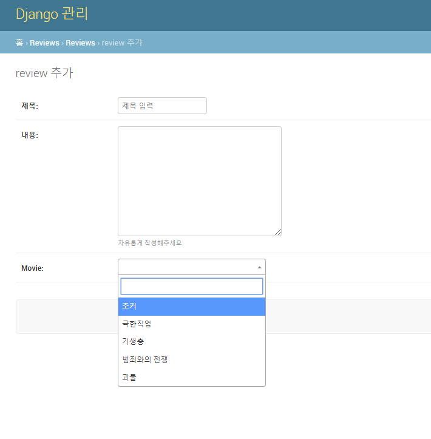
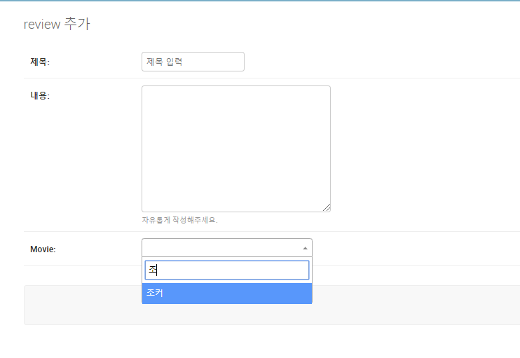
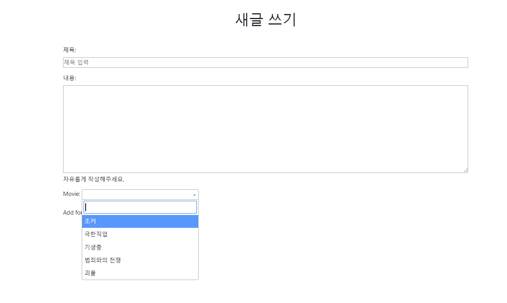
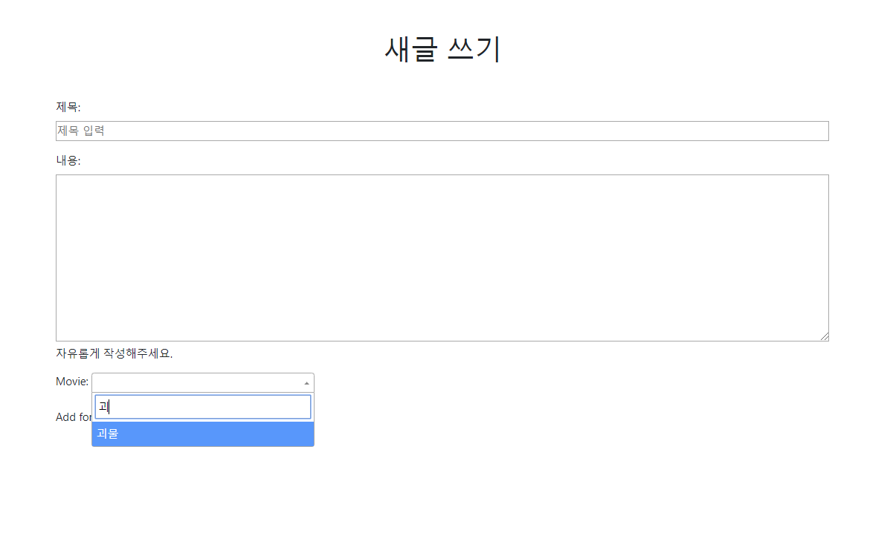

# django_pjt 4


### 프로젝트 목적

> 1:N과 M:N의 관계에 익숙해지는 것이 목표였다.


#### 구현과정

-  페어였던 수진이와 ERD를 먼저 대략적으로 만들어보고, 어떻게 모델링을 할지 결정을 했다.
-  그리고 `User` 모델과 관련되고 `accounts`앱과 관련된 것들은 수진이가 했고, `Movie`와 `Reivew`는 내가 만들었고, `Comment` 및 `M:N` 관계는 같이 만들었다.
- 그리고 `Movie`와 `Review`의 앱을 따로 만들었다.
  - 따로 만든 이유 중 하나는 `Movie`는 말 그대로, 영화 데이터를 저장하기 위한용도였다.
  - `Review`는 영화에 대한 감상평을 적는 것이라 생각되어져 두개를 분리해서 만들었다.
- 앱을 만든순서는 `User` -> `Movie` ->`Review` 순이었다.
  - 프로젝트에서 모든 경우에 `User`모델이 기본적으로 필요해서 가장 먼저했고,
  - `Review`를 작성하기 위해선 `Movie`가 필요해서 `Movie` 다음에 `Review`를 했다.
- 모델을 만들고 난뒤에는 계속했던 `CRUD`작업과 동일했기 때문에, 단순반복의 일이었다.
  - 하지만 여기서 주의해야했던것은 인증된 유저인지 아닌지 구분하는것과
  - 인증된 유저라도 접근권한이 있는지 없는지를 판단해줘야했다.
- 그리고 마지막으로 `M:N` 관계를 설정했는데, 이 부분은 어렵기도 했고, 큰틀의 기능보다는 중요성이 낮다고 생각되어 후순위가 되었다.
- `M:N` 관계를 설정할때, 참조인지 역참조인지 헷갈리는 점들이 많았다.
- `message` 모듈을 쓰는것에 익숙해져야겠다.


#### 구현상의 어려웠던 점


##### M:N 관계

- 구현상에 제일 어려웠던 점은 익숙치 않은 `ORM`을 익숙해져야한다는 것이었다.
  - 예를 들어 좋아요 버튼을 구현할때, 로그인한 유저가 이미 눌렀는지 안눌렀는지 판별하기 위해 여러가지 방법이 있는데,
  - `review.like_users.filter(id=request.user.id).exists()`
    - 이 방법은 쿼리셋의 메소드를 이용하여,  `filter`를 통해 좋아용한 유저에 로그인한 유저가 있는지 찾고 `exists()` 로 존재하는지 확인해주는 방식이다.
  - `request.user in review.like_users.all()`
    - 이 방법은 `Queryset`이 하나의 리스트인걸 이용해서 안에 있는지 확인하는 방법이다.
  - 참조로 된다는 것은 역으로 된다는 것을 기억해줘야한다.
    - `request.user.like_reviews.filter(id = review.id).exists()`
      - 이런식으로 역으로도 존재하는 것을 주의하면 된다.


##### forms.html

- 구현상에 어려웠던 점은 처음에 `Movie`와 `Review`를 1:N 관계를 설정하였다.

- 사용자가 등록된 영화만 고르게 하기 위하여, `forms.py`작성시 `fields`에 `movie`를 빼지 않았다.

- 하지만 처음에 나타난 문제가 select box로 나오는데 `Movie Object(1)` 이런식으로 나왔다. 

- 이렇게 되면 이게 무엇인지 구분하기 힘들것이다.

- 해결한 방법은

  ```python
  class Movie(models.Model):
      title = models.CharField(max_length = 100)
      poster = models.CharField(max_length = 200)
      def __str__(self):
          return '%s' % (self.title)
  ```

- 오버라이딩을 이용한것이다. 

- 위와 같이 할시 `__str__`에서 리턴되어지는 형태로 return이 된다.


- 이 방법의 문제점은 사용자가 전체를 전부 뒤져봐야한다는 것이다. 그래서 이걸 해결할 방법이 없나 찾아보다가 `dal`이라는 모듈을 찾았다.

- 해당 모듈은 `django-autocomplete-lite` 이고, 이것은 자동완성에 도움을 주는 것이다. 

- 해당 모듈을 쓰기 위해서는 먼저 `settings.py`의 `INSTALLED_APPS`에 `'dal','dal_select2',` 을 추가를 해줘야한다.

- 다음의 과정은 2가지 문서를 참고했다.

  - https://django-autocomplete-light.readthedocs.io/en/master/tutorial.html#create-an-autocomplete-view 

    - 이 문서는 공식문서이다. 
    - 하지만 처음부터 보면 이해하기 어려웠다.

  - [https://riptutorial.com/ko/django/example/7415/%ED%81%B0-%ED%85%8C%EC%9D%B4%EB%B8%94%EC%9D%84-%EC%B0%B8%EC%A1%B0%ED%95%98%EB%8A%94-%EC%99%B8%EB%9E%98-%ED%82%A4-%EB%8B%A4%EB%A3%A8%EA%B8%B0](https://riptutorial.com/ko/django/example/7415/큰-테이블을-참조하는-외래-키-다루기)

    - 이 문서는 `dal`을 통해 `admin`페이지에 자동완성을 구현하는 방식이었다.
    - 그래서 이걸 먼저 따라 친다음 업그레이드를 했다.

  - 2번째 url에 나온것처럼 상황에 맞게 따라쳤다.

    - ```python
      # /reviews/views.py
      from dal import autocomplete
      from movies.models import Movie
      
      class MovieAutocomp(autocomplete.Select2QuerySetView):
          def get_queryset(self):
              qs = Movie.objects.all()
              if self.q:
                  print(qs.values())
                  qs = qs.filter(title__istartswith = self.q)
                  print(qs)
              return qs
      ### 이 부분은 우리가 쿼리셋에 입력한 값을 실시간으로 filter를 넣어 만족하는 쿼리셋을 반환해주는 것이다.
      ```

    - ```python
      # /reveiws/urls.py
      
      urlpatterns =[
          
          
              path('movie-autocomp/',views.MovieAutocomp.as_view(),name = 'movie-autocomp')
      ]
      ### 2번째 문서에는 url로 되어있지만 우리는 path를 쓰므로, path로 고쳐줬다. 그리고 내가 만든 class를 부르고, 클래스형 뷰를 호출하기 위해서 `as_view()`메소드를 부른것같다.
      ### 이부분을 좀더 공부해야 할 것같다.
      ```

    - ```python
      # /reviews/forms.py
      from dal import autocomplete
      from movies.models import Movie
      
      class ReviewForm(forms.ModelForm):
          .....
              movie = forms.ModelChoiceField(
              queryset = Movie.objects.all(),
              widget = autocomplete.ModelSelect2(url='reviews:movie-autocomp')
      
              )
          ......
      ### 내가 자동완성시키고 싶은 컬럼을 forms.ModelChoiceField로 만들어주고
      #### 내가 칼럼에 해당되는 객체를 queryset으로 만들어서 저장해줬다.
      #### widget으로 autocomple.ModelSelect2를 썼고, url은 위에서 내가 만들어준 urls.py의 url로 연결시켜줬다.
      ```

    - ```python
      # /reviews/admin.py
      from django.contrib import admin
      from .forms import ReviewForm
      from .models import Review
      # Register your models here.
      
      @admin.register(Review)
      class ReviewAdmin(admin.ModelAdmin):
          form = ReviewForm
          
      ### 이렇게 만들어진 ReviewForm을 admin에 추가하면 된다.
      ```

    - 결과

      

      

    - 관리자 페이지에서 정상작동하는 것을 알 수 있다.

    - 하지만 이것은 관리자페이지에서만 작동하는 것이고, 실제 `create`에서 작동을 하지않는것을 알 수 있다.

    - 그래서 이 문제점을 해결하기 위해, `dal`공식문서를 읽어보았다.

      - 공식문서 중에서 https://django-autocomplete-light.readthedocs.io/en/master/tutorial.html#using-autocompletes-outside-the-admin 

      - admin 밖에서 자동완성을 하는 방법에 대해 나온 부분이 있었다. 이걸 그대로 똑같이 따라했다.

      - 그 결과

        

      - 

    - 이렇게 자동완성을 할 수 있었다.


### 프로젝트를 하면서 곱씹어봐야할 점과 고쳐야할 점

- 먼저 M:N 관계에 더 익숙해지고, `ORM`을 통해서 좀 더 숙달해야할것같다.

- 이번에는 데이터가 적어서 `SQL`의 호출회수가 적었지만
  - 다음번에는 `select_related` ,`prefetch_related` 에 좀 더 익숙해져야할것 같다.
    - `selected_related`는 N:1에서 N쪽에서 쓸수있다.
    - `prefetch_related`는 M:N 관계 1:N관계에서도 쓸수 있다.
      - 또한 , `Prefech` 옵션을 통해 중개관계를 엮을수 있다.
      - ex ) 만약 Review의 댓글과 댓글작성자를 한꺼번에 부르고 싶을때에는 
        - `Review.objects.prefetch_related(`
          `Prefetch('comment_set',`
          `queryset = Comment.objects.select_related('user')`
          `))`
  
- 사용자 편의를 위해 자동완성 기능을 구현하는데 힘들었다. 아직 `js`에 익숙치 않고, 공식문서를 읽는것에 어려움을 겪는 것 같다. 이러한 부분을 보완해 나가야할 것 같다.

- 데이터를 한번에 입력하는 방법이 익숙치 않는것같다. `csv`이나 `json`으로 만드는 것부터 어려움을 겪는다.

- `sqlite3`에 들어가 있을시에는 `.import 파일명 테이블명`형식으로 한번에 모든 데이터를 입력할 수 있다.

- 이번주에 배운 `serializer`에 좀 더 익숙해져봐야할 것 같다.

- 이번에 무비를 고르는데 썼던, 오버라이딩을 활용하면 저번에 했던 `either`를 좀 더 깔끔하게 구현할 수 있을것 같다.

- 아직 모듈에 대해서 익숙치 않다. 모듈위치를 한번 더 외워봐야할 것 같다.

- `messages` 모듈에 익숙치 않다.

  - `messages.warning(request,"쓰고싶은말")` 처럼 쓴다.

  - 이걸 쓰기전에 `from django.contrib import messages` 뷰에 모듈을 추가해줘야하고,

  -  `settings.py`에 `MESSAGE_STORAGE = 'django.contrib.messages.storage.session.SessionStorage'` 를 추가해줘야한다.

    ```html
    <!--base.html -->
    
        <ul class="messages list-unstyled ">
            
            <li class="bg-{{ message.tags }} px-5 py-3 h3 ">{{ message }}</li>
            
        </ul>
    ```

  - `messages`는 어디서나 써야하기 때문에 `base.html`에 넣어주는게 기본적이고,`bootstrap`과 연관해서 많이 쓴다. ` bootstrap`의 color에 `messages.tag`와 같은이름이 존재하기 때문이다.

