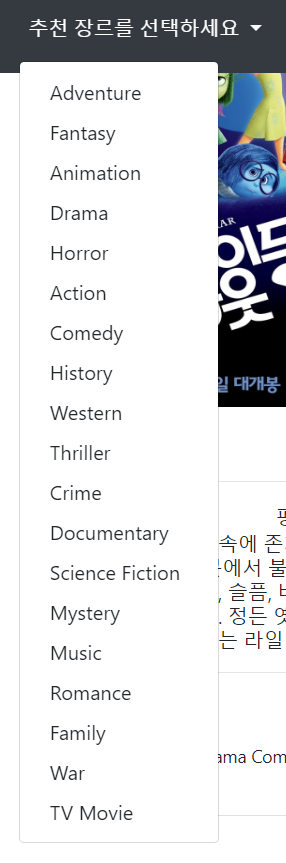

# Django_pjt5


#### 프로젝트의 목표

> 주어진 데이터를 이용해서,  pagignation을 하고, 좋아요 버튼을 그 전의 새로고침으로 고쳐지는것이 아닌, js를 이용해 DOM으로 바로 조작이 가능하게 해주고, 마지막으로 추천알고리즘을 구현하는 것이었다.


#### 기능상의 구현의 중요한 점

##### 1. pagingnation 을 구현하는 법

- django에서 제공하는 Paginator를 이용해서 한다.
- `Paginator(인스턴스,한 페이지에 보이는거)`
- 위와 같이 하면 한 페이지에 나눌 대상으로 다 나눠진다.
- `request.GET.get('page')` 를 통해 해당 페이징네이터의 번호를 가져온다.
- 그리고 마지막으로 `paginator.get_page(page_number)` 를 통해 해당 페이지의 객체만을 가져오고,
- 그걸 반환해주면 된다.
- 인제 페이지네이터를 직접 구현을 해도 되지만, 부트스트랩을 이용해 만들어도 된다. 
  - django_pagination을 통해 구현하면 간단하므로, 패키지를 설치해주고, apps에 추가해주면 된다.
  - `<ul class= "col-4"></ul>`


##### 2. 좋아요 기능 구현

```html
<script>  
  const likeBtns = document.querySelectorAll('[data-like]')
  
  likeBtns.forEach((likeBtn)=>{
    likeBtn.addEventListener('click',function(event){
      const movieId = event.target.dataset.id
      const movieLikeCount = document.querySelector(`#like-count-${movieId}`)

      axios.get(`/movies/${movieId}/like/`)
      .then((response)=>{
        console.log(response.data)
        if (response.data.status){
          event.target.innerText = '♥'
          event.target.style.color = "crimson"
          movieLikeCount.innerHTML = response.data.like_count

        } else{
          event.target.innerText = '♡'
          event.target.style.color = "black"
          movieLikeCount.innerHTML = response.data.like_count
          

        }


      })

    })

  })
</script>
```


-  좋아요버튼을 모두 가져오고, 그걸 `foreach`를 통해 모든 `event`를 추가 해준다. 
- `axios.get(`/movies/${movieId}/like/`)` 를 통해 좋아요버튼에 원래 연결되어있던 url로 ajax를 보내주고 그거에 대한 promise로 좋아요버튼을 활성화 해주면 된다.
- 여기서 `querselector` 의 추가적인 기능을 알아보면, 태그 안의 속성을 기준으로 값을 찾고 싶으면 `[속성이름]` 으로 찾아주면 된다.
- 여기서 속성은 태그 안에 `속성:"값"` 이런식으로 되어있는걸 말한다.
- 또한 속성이 `data-이름 : 값` 으로 저장되어있을시, 해당 객체에서 저 값에 접촉이 가능한데
- `객체.dataset.이름 ` 을 통해 접촉이 가능하다.


##### 3. 추천게시판 만들기

- 추천 게시판을 만들때 알고리즘을 고르는게 힘들었다.
- 최초로 만들었던 알고리즘은 사용자가 장르를 고르면. 그 장르 중에 `popularity`와 `vote_Average`를 내림차순으로 해서 골라주었다.
- 이 떄 `Genre.objects.get()` 을 통해 하나의 객체를 받아서,
   ManyToManyField 를 통해 역참조로 해당장르가 있는 영화들을 골라주었다.


#### 프로젝트에서 어려웠던 점 

> 이 프로젝트는 지금까지 배운걸 응용하는 프로젝트였다. 해당 프로젝트를 하면서 가장 어려웠던 점은, 알고리즘에 알맞게 ORM을 통해 찾아주는 것과 js를 통해 ajax를 구현하는 점이었다.


#### 프로젝트에 추가로 해준 기능

- 추천을 장르를 랜덤으로 선택하는 것을 구현해줬다. 

  - 이 방법은 `Genre.objects.all().values('id')` 를 list 화 시켜서 id 값들을 구해주었다.
  - 그리고 난뒤 `random.choice`를 통해 하나의 id 값을 가져오고, 이 장르를 가진 영화를 가져오는 방식이었다.
  - 여기서 추가적으로 어떤 장르는 아예 없는것도 있어서 while문을 돌려, 아무것도 없는 장르는 빼도록 했다.

- 두번째 추천 방식은 영화 전체에서 랜덤으로 추천해주는 것이었다.

  - 이 방식은 위와 비슷하다. Movie.objects.all().values('id')를 통해,
    전체 id 값을 가져오고 그 중에서 10개를 뽑도록했다.
  - 이때 쓴 방법은 `random.sample`이었다.

- 마지막으로 추가한 방식은 장르를 중복 선택해서, 장르에 해당하는 모든 영화들을 뽑아서 그 중 중복을 제거하고 `popularity`와 `vote_average`를 내림차순을 해줬다.

  - 이걸 위해서 `recommand` 라는 views 함수에 `GET` 요청과 `POST` 요청을 통해 나눠줬다.

  - GET 요청일때 장르를 중복선택할 수 있도록 form을 보내줬다. 

    - 해당 폼은 Movie 모델을 이용해서 했다.

      ```python
      class MovieForm(forms.ModelForm):
          class Meta:
              model = Movie
              fields = ['genres']
              widgets = {
                  'genres':forms.CheckboxSelectMultiple(attrs={
                      'class':'list-unstyled'
                  })
              }
      ```

    - CheckboxSelectMultiple을 통해 여러개의 체크박스를 만들어줬다.

    - 그걸 GET 요청이 오면 form을 보내줬다.

      ```python
      if request.method == 'POST':
              a= request.POST
              genre_list = a.getlist('genres')
              movies = Movie.objects.filter(genres__in=genre_list).order_by('-popularity','-vote_average').distinct()[:10]
              context ={
                  'movies':movies
              }
              return render(request,'movies/recommand_random.html',context)
      ```

    - POST 방식으로 오면 이것은 Querydict 타입으로 온다.

    - 근데 이 타입은 dict라고 생각해서 Querydict[key]를 넣어주면 value가 여러가지가 있으면 그 중 마지막 값만 반환해준다.

    - 그걸 해결해주기 위해서 getlist 메서드를 통해 해당 key에 있는 여러개의 값을 가져와줬다.

    - 최종적으로 `genre__in = genre_list` 를 필터를 통해 `__in` 룩업을 통해 `gere_list`에 있는 영화들을 가져와주고, 거기에 중복값이 있으므로, `distinct`를 통해 중복을 없애주고 10개를  리턴해줬다.

    


- 이번 프로젝트에서 가장 시간이 많이 걸렸던 것은 navbar에 추천장르를 만드는 것이었다.

  

  - 처음에 수업시간에 배운 templatetags를 이용해 구현을 할려고했더니 해당 기능은 string으로 보내주기 때문에 원하는 결과를 갇기 힘들었다.

  - `context_processors`기능을 이용해서 구현했다. 해당 기능은 전역 template에서 사용가능한 변수를 만들어주는 것이다. 

  - django에서 기본적으로 제공하는 `{{request}}` 나 `{{user}}` 를 쓸수 있는 이유가, `context_processors` 에 기본적으로 제공하기 때문이다.

  - 만드는 법은 먼저 쓸 app에 `context_processors`라는 py를 만들어준다.

  - 그리고 그 안에 반환해주고 싶은 값을 함수로 만들어준다.

    ```python
    from .models import Genre
    def genre_list(request):
        gens = Genre.objects.all()
        return {
            'gens':gens,
        }
    ```

  - 그리고 난뒤에 `context_processors`에 `movies.context_processors.genre_list`를 추가해준다.

    - `앱이름.py이름.함수이름` 으로 해주면 된다.

  - 이렇게 만들어주면 return 되는 변수를 쓰면 된다. `{{gens}}` 다른것과 중복되지않도록 변수명을 다르게 해줬다.

  - 이것은 쿼리셋 변수 그자체로 넘어오므로 for문을 돌려 .name 이나 .id에 접근이 가능하다.


- 카드 에서 말줄임을 css로 구현하는법

  - ```css
    <p style="overflow: hidden;
              text-overflow: ellipsis;
              display:-webkit-box;
              -webkit-box-orient: vertical;
              -webkit-line-clamp: 5;
              word-wrap: break-word;
              line-height: 1.2em;
              height: 6em;
    
                ">
    ```

  - 위와 같이 overflow는 숨겨주고

  - text-overflow는 줄임말로 해준다.

    - 그리고 -webkit-box를 display에 해주고,
    - -webkit-box-orient 와 -webkit-line-clamp를 설정해준다. 이것을 설정해줘야, 몇번쨰 줄에서 ...으로 나타내줄지 결정해준다.
    - 그리고 글자의 높이와 전체 높이를 정해준다.