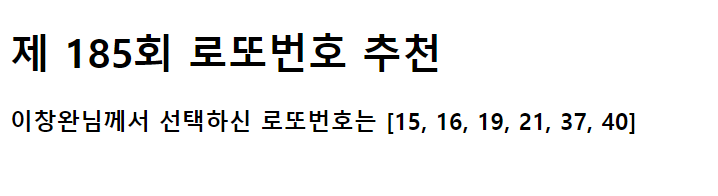

#### 1. intro/urls.py

```python

from django.contrib import admin
from django.urls import path
from pages import views
urlpatterns = [
    path('admin/', admin.site.urls),
    path('lotto/',views.lotto),
]

```

#### 2. pages/views.py

```python
from django.shortcuts import render

# Create your views here.
def lotto(request):
    import random
    lucky=random.sample(range(1,46),6)
    lucky.sort()
    context={
        'lotto':lucky,
        'name':'이창완',
    }
    return render(request,'lotto.html',context)
```

#### 3.templates/lotto.html

```html
<!DOCTYPE html>
<html lang="ko">
<head>
    <meta charset="UTF-8">
    <meta name="viewport" content="width=device-width, initial-scale=1.0">
    <meta http-equiv="X-UA-Compatible" content="ie=edge">
    <title>Document</title>
</head>
<body>
    <h1>제 185회 로또번호 추천</h1>
    <h3>{{name}}님께서 선택하신 로또번호는 {{lotto}}</h3>

</body>
</html>
```

