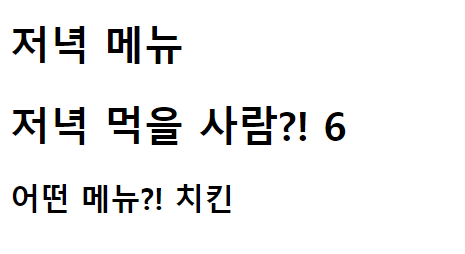

##  아래와 같은 양식으로 결과 사진과 views.py, urls.py, dinner.html 파일의 코드를 별도의 마크다운 파일에 작성하여 제출하시오.



### 1. intro/urls.py

```python
from django.contrib import admin
from django.urls import path
from pages import views
urlpatterns = [
    path('admin/', admin.site.urls),
    path('dinner/<str:menu>/<int:number>/',views.dinner),
]
```

### 2. pages/views.py

```python
from django.shortcuts import render

def dinner(request,menu,number):
    context={
        'menu':menu,
        'number':number,
    }
    return render(request,'dinner.html',context)

```

### 3. templates/dinner.html

```python
<!DOCTYPE html>
<html lang="ko">
<head>
    <meta charset="UTF-8">
    <meta name="viewport" content="width=device-width, initial-scale=1.0">
    <meta http-equiv="X-UA-Compatible" content="ie=edge">
    <title>Document</title>
</head>
<body>
    <h1>저녁 메뉴</h1>
    <h1>저녁 먹을 사람?! {{ number }}</h1>
    <h2>어떤 메뉴?! {{ menu }}</h2>

</body>
</html>
```

