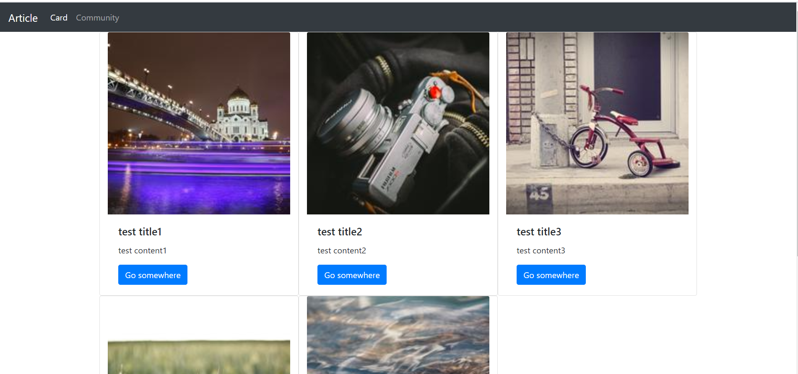
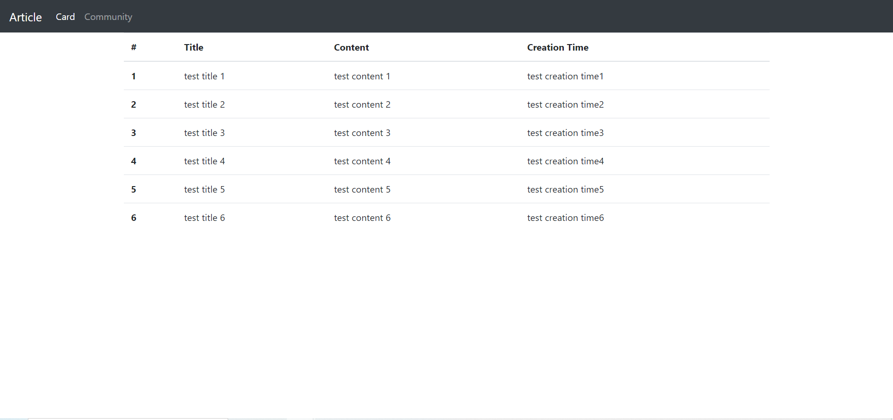

### 1. intro/settings.py

```python
"""
Django settings for intro project.

Generated by 'django-admin startproject' using Django 2.1.15.

For more information on this file, see
https://docs.djangoproject.com/en/2.1/topics/settings/

For the full list of settings and their values, see
https://docs.djangoproject.com/en/2.1/ref/settings/
"""

import os

# Build paths inside the project like this: os.path.join(BASE_DIR, ...)
BASE_DIR = os.path.dirname(os.path.dirname(os.path.abspath(__file__)))


# Quick-start development settings - unsuitable for production
# See https://docs.djangoproject.com/en/2.1/howto/deployment/checklist/

# SECURITY WARNING: keep the secret key used in production secret!
SECRET_KEY = 'y0g2$tz&+h5e^$s$%zxsa938)tw4%-crcr@2$cogrjewm2tx!m'

# SECURITY WARNING: don't run with debug turned on in production!
DEBUG = True

ALLOWED_HOSTS = ['*']


# Application definition

INSTALLED_APPS = [
    'django.contrib.admin',
    'django.contrib.auth',
    'django.contrib.contenttypes',
    'django.contrib.sessions',
    'django.contrib.messages',
    'django.contrib.staticfiles',
    'pages',
]

MIDDLEWARE = [
    'django.middleware.security.SecurityMiddleware',
    'django.contrib.sessions.middleware.SessionMiddleware',
    'django.middleware.common.CommonMiddleware',
    'django.middleware.csrf.CsrfViewMiddleware',
    'django.contrib.auth.middleware.AuthenticationMiddleware',
    'django.contrib.messages.middleware.MessageMiddleware',
    'django.middleware.clickjacking.XFrameOptionsMiddleware',
]

ROOT_URLCONF = 'intro.urls'

TEMPLATES = [
    {
        'BACKEND': 'django.template.backends.django.DjangoTemplates',
        'DIRS': [],
        'APP_DIRS': True,
        'OPTIONS': {
            'context_processors': [
                'django.template.context_processors.debug',
                'django.template.context_processors.request',
                'django.contrib.auth.context_processors.auth',
                'django.contrib.messages.context_processors.messages',
            ],
        },
    },
]

WSGI_APPLICATION = 'intro.wsgi.application'


# Database
# https://docs.djangoproject.com/en/2.1/ref/settings/#databases

DATABASES = {
    'default': {
        'ENGINE': 'django.db.backends.sqlite3',
        'NAME': os.path.join(BASE_DIR, 'db.sqlite3'),
    }
}


# Password validation
# https://docs.djangoproject.com/en/2.1/ref/settings/#auth-password-validators

AUTH_PASSWORD_VALIDATORS = [
    {
        'NAME': 'django.contrib.auth.password_validation.UserAttributeSimilarityValidator',
    },
    {
        'NAME': 'django.contrib.auth.password_validation.MinimumLengthValidator',
    },
    {
        'NAME': 'django.contrib.auth.password_validation.CommonPasswordValidator',
    },
    {
        'NAME': 'django.contrib.auth.password_validation.NumericPasswordValidator',
    },
]


# Internationalization
# https://docs.djangoproject.com/en/2.1/topics/i18n/

LANGUAGE_CODE = 'en-us'

TIME_ZONE = 'UTC'

USE_I18N = True

USE_L10N = True

USE_TZ = True


# Static files (CSS, JavaScript, Images)
# https://docs.djangoproject.com/en/2.1/howto/static-files/

STATIC_URL = '/static/'

```

### 2.intro/urls.py

```python
"""intro URL Configuration

The `urlpatterns` list routes URLs to views. For more information please see:
    https://docs.djangoproject.com/en/2.1/topics/http/urls/
Examples:
Function views
    1. Add an import:  from my_app import views
    2. Add a URL to urlpatterns:  path('', views.home, name='home')
Class-based views
    1. Add an import:  from other_app.views import Home
    2. Add a URL to urlpatterns:  path('', Home.as_view(), name='home')
Including another URLconf
    1. Import the include() function: from django.urls import include, path
    2. Add a URL to urlpatterns:  path('blog/', include('blog.urls'))
"""
from django.contrib import admin
from django.urls import path
from pages import views

urlpatterns = [
    path('admin/', admin.site.urls),
    path('card/',views.card),
    path('community/',views.community),
]

```

### 3. pages/views.py

```python
from django.shortcuts import render

# Create your views here.
def card(request):

    articles = [
        ['test title1', 'test content1'],
        ['test title2', 'test content2'],
        ['test title3', 'test content3'],
        ['test title4', 'test content4'],
        ['test title5', 'test content5'],
    ]
    context={
        'articles':articles,
    }
    return render(request,'card.html',context)

def community(request):
    articles = [
            ['#', 'Title', 'Content', 'Creation Time'],
            ['test title 1', 'test content 1', 'test creation time1'],
            ['test title 2', 'test content 2', 'test creation time2'],
            ['test title 3', 'test content 3', 'test creation time3'],
            ['test title 4', 'test content 4', 'test creation time4'],
            ['test title 5', 'test content 5', 'test creation time5'],
            ['test title 6', 'test content 6', 'test creation time6'],
        ]
    context={
        'articles':articles,
    }
    return render(request,'community.html',context)
```

### 4. pages/templates/base.html

```html
<!DOCTYPE html>
<html lang="ko">
<head>
    <meta charset="UTF-8">
    <meta name="viewport" content="width=device-width, initial-scale=1.0">
    <meta http-equiv="X-UA-Compatible" content="ie=edge">
    <title>Document</title>
    <link rel="stylesheet" href="https://stackpath.bootstrapcdn.com/bootstrap/4.4.1/css/bootstrap.min.css" integrity="sha384-Vkoo8x4CGsO3+Hhxv8T/Q5PaXtkKtu6ug5TOeNV6gBiFeWPGFN9MuhOf23Q9Ifjh" crossorigin="anonymous">
</head>
<body>
    <nav class="navbar navbar-expand-lg navbar-dark bg-dark">
      <a class="navbar-brand" href="#">Article</a>
      <button class="navbar-toggler" type="button" data-toggle="collapse" data-target="#navbarNavAltMarkup" aria-controls="navbarNavAltMarkup" aria-expanded="false" aria-label="Toggle navigation">
        <span class="navbar-toggler-icon"></span>
      </button>
      <div class="collapse navbar-collapse" id="navbarNavAltMarkup">
        <div class="navbar-nav">
          <a class="nav-item nav-link active" href="/card">Card <span class="sr-only">(current)</span></a>
          <a class="nav-item nav-link" href="/community">Community</a>

        </div>
      </div>
    </nav>
    <div class="container">
        
        
    </div>

    <script src="https://code.jquery.com/jquery-3.4.1.slim.min.js" integrity="sha384-J6qa4849blE2+poT4WnyKhv5vZF5SrPo0iEjwBvKU7imGFAV0wwj1yYfoRSJoZ+n" crossorigin="anonymous"></script>
<script src="https://cdn.jsdelivr.net/npm/popper.js@1.16.0/dist/umd/popper.min.js" integrity="sha384-Q6E9RHvbIyZFJoft+2mJbHaEWldlvI9IOYy5n3zV9zzTtmI3UksdQRVvoxMfooAo" crossorigin="anonymous"></script>
<script src="https://stackpath.bootstrapcdn.com/bootstrap/4.4.1/js/bootstrap.min.js" integrity="sha384-wfSDF2E50Y2D1uUdj0O3uMBJnjuUD4Ih7YwaYd1iqfktj0Uod8GCExl3Og8ifwB6" crossorigin="anonymous"></script>
</body>
</html>
```

### 5. pages/templates/card.html

```html



    <div class="row">
    
        <div class="card col-4" style="width: 18rem;">
          
          <div class="card-body">
            <h5 class="card-title">{{ article.0 }}</h5>
            <p class="card-text">{{ article.1 }}  </p>
            <a href="#" class="btn btn-primary">Go somewhere</a>
          </div>
        </div>
    
    </div>

```

### 6. pages/templates/community.html

```html




    

        
              <table class="table">
              <thead>
                <tr>
                    
                          <th scope="col">{{ arti }}</th>
                    
                </tr>
              </thead>
              <tbody>
        

                <tr>
                    <th scope="row">{{ forloop.counter0}}</th>
                    
                        
                          <td>{{ arti }}</td>
                        
                          <td>{{ arti }}</td>
                        
                    
                </tr>

        
    
    </tbody>
    </table>



```

### Cards 화면




### Community 화면

