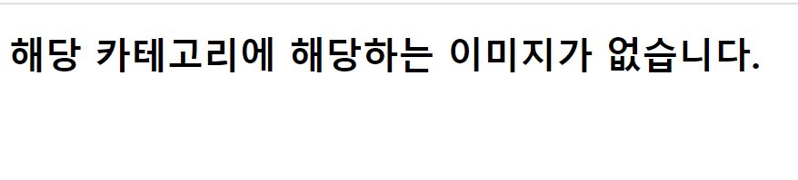
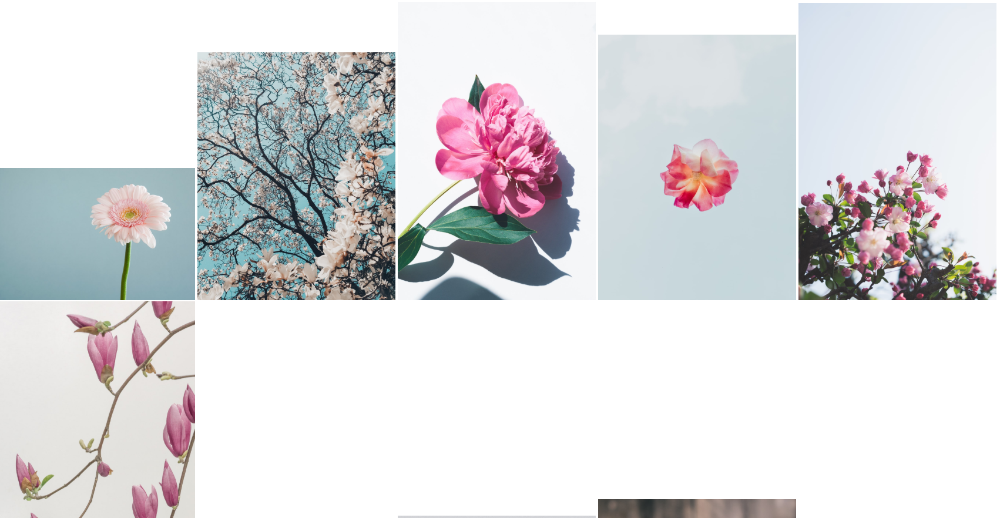

### 1. views.py

```python
from django.shortcuts import render
import requests
from pprint import pprint
# Create your views here.
def index(request):
    return render(request,'index.html')

def gallery(request):
    keyword=request.GET.get('search')
    url=f'https://api.unsplash.com/search/photos/?client_id=6sP7JH8SungF9zLg3wi7yCSLC1SPFKCwBYqVOYUvHcc&query={keyword}'
    res=requests.get(url).json()
    imglist=res.get('results')
    result=[]
    for image in imglist:
        result.append(image.get('urls').get('regular'))
    print(result)
    context={
        'result':result
    }
    return render(request,'gallery.html',context)
```

### 2. urls.py

```python
"""mygallery URL Configuration

The `urlpatterns` list routes URLs to views. For more information please see:
    https://docs.djangoproject.com/en/2.1/topics/http/urls/
Examples:
Function views
    1. Add an import:  from my_app import views
    2. Add a URL to urlpatterns:  path('', views.home, name='home')
Class-based views
    1. Add an import:  from other_app.views import Home
    2. Add a URL to urlpatterns:  path('', Home.as_view(), name='home')
Including another URLconf
    1. Import the include() function: from django.urls import include, path
    2. Add a URL to urlpatterns:  path('blog/', include('blog.urls'))
"""
from django.contrib import admin
from django.urls import path
from pages import views
urlpatterns = [
    path('admin/', admin.site.urls),
    path('pages/',views.index),
    path('pages/gallery/',views.gallery),
]
```

### 3. index.html

```html
<!DOCTYPE html>
<html lang="ko">
<head>
    <meta charset="UTF-8">
    <meta name="viewport" content="width=device-width, initial-scale=1.0">
    <meta http-equiv="X-UA-Compatible" content="ie=edge">
    <title>Document</title>
</head>
<body>
    <h1> 고화질 이미지 생성기</h1>
    <form action="/pages/gallery/">
        <input type="text" name="search">
        <input type="submit">
    </form>
</body>
</html>
```

### 4. gallery.html

```html
<!DOCTYPE html>
<html lang="ko">
<head>
    <meta charset="UTF-8">
    <meta name="viewport" content="width=device-width, initial-scale=1.0">
    <meta http-equiv="X-UA-Compatible" content="ie=edge">
    <title>Document</title>
</head>
<body>
    
        
    
    <h1> 해당 카테고리에 해당하는 이미지가 없습니다.</h1>
    
</body>
</html>
```


### 결과 이미지

<hr>

### - 검색 결과가 없는 경우



<hr>

### - 검색결과가 있는 경우




<hr>


