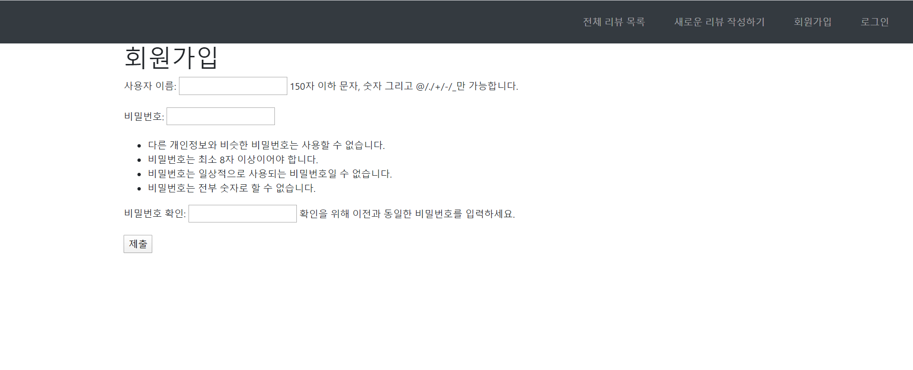
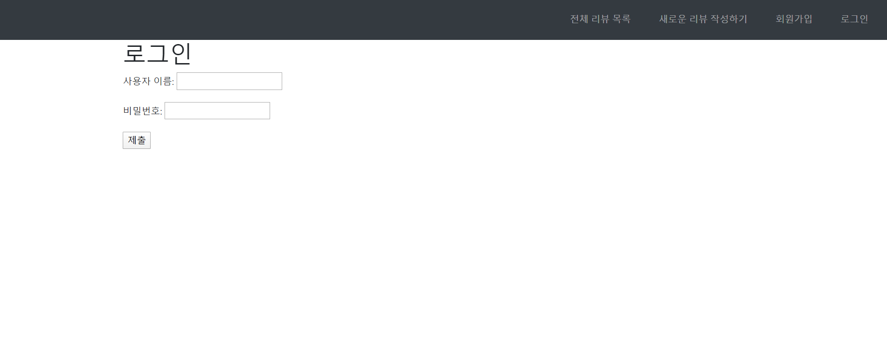
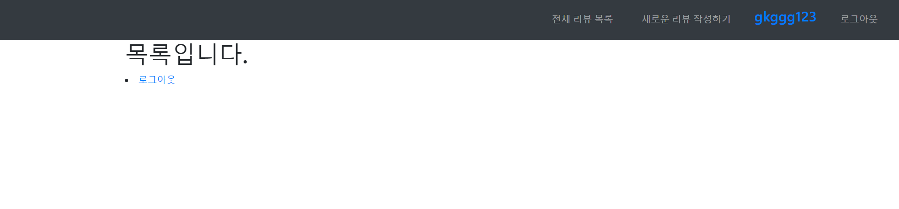

### accounts/views.py

```python
from django.shortcuts import render,redirect
from django.contrib.auth.forms import UserCreationForm,AuthenticationForm
from django.contrib.auth import login as auth_login
from django.contrib.auth import logout as auth_logout
from django.contrib.auth.decorators import login_required
# Create your views here.
def index(request):

    return render(request,'accounts/index.html')


def signup(request):
    if request.method=='POST':
        form=UserCreationForm(request.POST)
        if form.is_valid():
            form.save()
            return render(request,'accounts/welcome.html')

    else:
        form=UserCreationForm()

    context={
        'form':form
    }
    return render(request,'accounts/form.html',context)

def login(request):
    if request.method=='POST':
        form =AuthenticationForm(request,request.POST)
        if form.is_valid():
            auth_login(request,form.get_user())
            return redirect('accounts:index')
    else:
        form=AuthenticationForm()
    context={
        'form':form
    }
    return render(request,'accounts/form.html',context)

@login_required
def logout(request):
    auth_logout(request)
    return redirect('accounts:index')
```


### 결과 화면

### 회원가입



### 로그인



### 로그아웃

