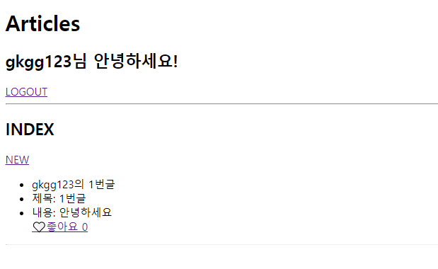
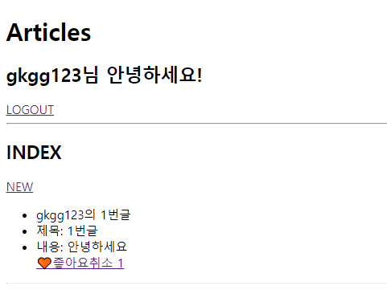

# 0428_exercise

### 1. views.py

```python
from django.shortcuts import render, redirect ,get_object_or_404
from .models import Article
from .forms import ArticleForm


def index(request):
    articles = Article.objects.order_by('-pk')
    context = {
        'articles': articles,
    }
    return render(request, 'articles/index.html', context)

def create(request):
    if request.method == 'POST':
        form = ArticleForm(request.POST)
        if form.is_valid():
            article = form.save(commit=False)
            article.user = request.user
            article.save()
            return redirect('articles:index')
    else:
        form = ArticleForm()
    context = {
        'form': form,
    }
    return render(request, 'articles/form.html', context)


def like(request,article_pk):
    article = get_object_or_404(Article,id=article_pk)
    if article.like_users.filter(id=request.user.id).exists():
        article.like_users.remove(request.user)
    else:
        article.like_users.add(request.user)
    return redirect('articles:index')
```


### 2. models.py

```python
from django.db import models
from django.conf import settings


class Article(models.Model):
    title = models.CharField(max_length=100)
    content = models.TextField()
    created_at = models.DateTimeField(auto_now_add=True)
    created_at = models.DateTimeField(auto_now=True)
    user = models.ForeignKey(settings.AUTH_USER_MODEL, on_delete=models.CASCADE)
    like_users = models.ManyToManyField(settings.AUTH_USER_MODEL, related_name='like_articles')

```


### 3. index.html

```html



  <h2>INDEX</h2>
  <a href="">NEW</a>
  
    <ul>
      <li>{{ article.user }}의 {{ article.pk }}번글</li>
      <li>제목: {{ article.title }}</li>
      <li>내용: {{ article.content }}</li>
      
      
      <a href="">🧡좋아요취소 {{ article_like.count }}</a>
      
      <a href="">🤍좋아요 {{ article_like.count }}</a>
      
      
    </ul>
    <hr>
  

```


#### 결과




