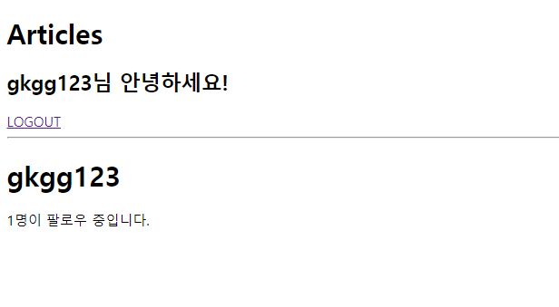
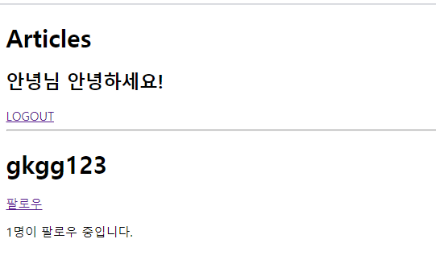
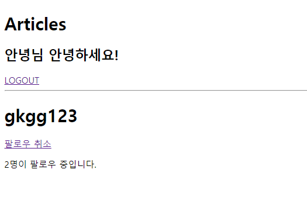

# 0428_workshop

### 1.  accounts/views.py

```python
from django.shortcuts import render, redirect,get_object_or_404
from django.contrib.auth.forms import UserCreationForm, AuthenticationForm
from django.contrib.auth.decorators import login_required
from django.contrib.auth import get_user_model
from django.contrib.auth import login as auth_login, logout as auth_logout
from .forms import CustomUserCreationForm

def signup(request):
    if request.method == 'POST':
        form = CustomUserCreationForm(request.POST)
        if form.is_valid():
            user = form.save()
            auth_login(request, user)
            return redirect('articles:index')
    else:
        form = CustomUserCreationForm()
    context = {
        'form': form,
    }
    return render(request, 'accounts/signup.html', context)

def login(request):
    if request.method == 'POST':
        form = AuthenticationForm(request, request.POST)
        if form.is_valid():
            auth_login(request, form.get_user())
            return redirect('articles:index')
    else:
        form = AuthenticationForm()
    context = {
        'form': form,
    }
    return render(request, 'accounts/login.html', context)

@login_required
def logout(request):
    auth_logout(request)
    return redirect('articles:index')

@login_required
def profile(request,username):
    User=get_user_model()
    profile_user=get_object_or_404(User,username=username)
    context={
        'profile_user': profile_user,
    }
    return render(request,'accounts/profile.html',context)


@login_required
def follow(request,username):
    me = request.user
    User= get_user_model()
    you = get_object_or_404(User,username=username)
    # if you.followers.filter(pk=me.pk).exists():
    # if me.followings.filter(pk=you.pk).exists():
    if me == you:
        return redirect('accounts:profile',username)
    else:
        if me in you.followers.all():
            you.followers.remove(me)
        else:
            you.followers.add(me)

        return redirect('accounts:profile',username)
```


### 2. accounts/models.py

```python
from django.db import models
from django.contrib.auth.models import AbstractUser
from django.conf import settings

class User(AbstractUser):
    followers= models.ManyToManyField(settings.AUTH_USER_MODEL,related_name='followings')

```


### 3. accounts/profile.html

```html



    <h1>{{ profile_user.username }}</h1>
    
        
            <a href="">팔로우 취소</a>
        
            <a href="">팔로우</a>
        
    
        <p>{{ profile_user.followers.count }}명이 팔로우 중입니다.</p>


```


### 결과





