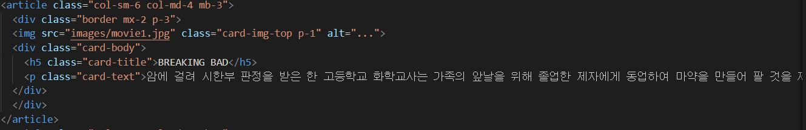
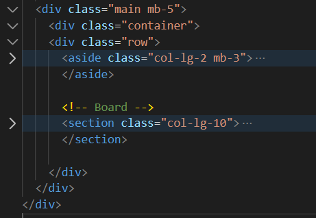
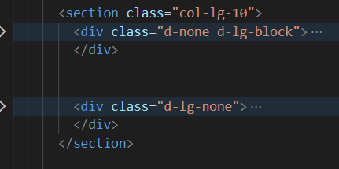

## 각 단계별 상세 구현 과정

#### 01. Navigation Bar & Footer

- 먼저 navbar가 768px 이상일때를 먼저 만들어줬다. 그리고 난뒤, 좌측으로 붙어있던 Home,Community,Login을 `justify-content-end` 로 우측정렬을 해줬다. 그리고 최상단에 계속 붙어있기 위해서 `sticky-top`을 선언해줬다.

- 그 다음에 768px 미만일때는 접는것을 만들어 주기 위해 `navbar-expand-md`을 사용해줬다.
  그리고 접혀질 부위를 `button`으로 설정해주고, 그때 접혀질 전체 `div`의 아이디와 `data-taget`

  `aria-controls`을  동일하게 해주고, `data-toggle`은 접혀지는 거니깐 `collaspe`를 해줬다.

  그리고 햄버거 아이콘 모양으로 접히므로 `navbar-toggler-icon`을 `span`태그안에 선언해줬다.

- Home 버튼을 강조하기 위해서 `font-weight-bold`를 해주고, 클릭전에도 같은 색깔을 보여주기 위해서 `<a>`태그에 `text-white text-decoration-none`를 선언해줬다.

  Community와 Login은 ` font-weight-light text-black-50 text-white-50 text-decoration-none`을 선언해줬다.

- 마지막으로 Modal은 Login `li`에 `data-toggle="modal" data-target="#exampleModal"`를 추가 선언해줘서 Login을 클릭하면 Modal이 작동하게 해줬다.
- Footer는 `fixed-bottom`으로 가장 밑에 위치하게 해주고, `d-flex`를 선언해주고, `justify-content-center align-items-center`를 해줘 가운데 수직,수평정렬을 해줬다.

#### 02. Home

- 상단 Header는 `carousel` 을 이용하여 만들어줬다.
- 하단 Header는 576px 이상이고 768px 미만일때 한 열에 2개씩 나오게 해줄려고 `col-sm-6`을 선언해줬고, 768px 이상일때 한열에 3개씩 나오게 해줄려고 `col-md-4`을 해줬다. 그리고 해당 포스터 밑에 여백을 주기 위해 `mb-3`을 선언해줬다. 그리고 576px 미만에는 한열에 1개씩 나오게 만들어야했는데, col에 대해 아무것도 선언을 안해주면, 자동적으로 col-12를 해준것과 마찬가지여서 생략 해줬다.
- 이렇게 나눠진 `items` 안에는 card를 만들어 줬다. 그리고 각 card 마다 같은 간격으로 떨어지게 만들려고, `article`에 `border`를 만든 것이 아닌 `article` 내부에 있는 `img`와 `div`를 하나의 `div`로 다시 감싸줘서 그 `div`에 `border`를 만들고 서로 떨어져있는것처럼 보여줄려고 `mx-3`을 줘서 좌우 마진을 줬고, `border`안에 이미지를 좀 띄워서 생성하기 위해 `p-3`을 설정해줬다.

- 이것이 하나의 카드 `ariticle`이고 이렇게 만든 card를 총 6개 생성해줬다.

#### 3. Community

- 먼저 navbar에서 `Home`이 강조되어있던걸 `Community`를 강조하기 위하여, 위에서 `Home`을 강조하기 위하여 작성한 클래스를 서로 바꿔준다.
- 게시판 목록과 게시판이 `width` 따라 차지하는 칸이 다르고, 서로 기능은 다르지만 원할하게 제시된 칸을 만족시켜주기 위하여, `main div`밑에 2개의 `div`를 추가해줘서, 

​		`aside`와 `section`을 전부 감싸는 `container` `row` `div`를 각각 만들어 줬다.

- 그리고 992px 미만에서는 `aside`가 12칸 `section`이 12칸, 992px 이상일때는 `aside` 2칸 `section`이 10칸을 차지하게 위해서, 위의 그림과 같이 `aside` `section`에 선언을 해줬다.

- 게시판 목록은 `aside` 밑에 하나의 `ul`과 그 안의 4개의 `li`를 만들어줬고, `ul`의 기본 스타일인 `marign-bottom`과 앞에 붙는 점을 없애 주기 위하여, `list-unstyled m-0`을 선언해줬다.

- 그리고 게시판 목록의 전체 border를 그려주기 위하여, `li` 태그 안에 각각 `border pl-4 py-3`를 선언 해줬다.

- 게시판은 `width` 에 따라서 테이블 모양이 다르므로,  2개의 `table`을 만들어주고 `display property`를 이용하여, 상황에 맞게 나오도록 만들어줬다.

  

- 위와 같이 992px 이상에서 보이는 테이블은 `d-none`이라하여 평소에는 보이지 않게 만들어주다가, `d-lg-block`을 설정해줘서 `lg` 이상일때 display 되도록 만들어줬다. 992px 미만에서는 보이는 테이블은 `d-lg-none`이라 설정해줘서, lg 사이즈 이상일때는 사라지도록 만들어줬다.

- 그래서 992px 이상일때와 미만일때 각각의 table을 따로 만들어주고, `Page navigation` 또한 각각 넣어주어, 상황에 맞게 나와주도록 만들어줬다.

- 992px이상일때는 bootstrap에서 제공되는 `table`형식을 이용하여 만들었고, 992px 미만일때는
  `list-group`을 이용하여 풀었다. 

## 어려웠던 부분

- `Navbar`에서 반응형으로 만들어주는 `collaspe`부분이었다. 그냥 `navbar`를 만드는것은 기존의 `d-flex`를 이용하여 만든적이 많았지만, 해당 프로젝트에서는 `width`에 따라 반응을 해줘야하기 때문에 그 부분을 찾는데 어려웠다.
- 그리고 최초에 `Modal`파트를 `navbar` 바로 밑에 작성을 했더니 문제가 발생해서, `Modal`을 `body` 닫히는 바로 위로 옮겨줘서 문제를 해결했지만 어떠한 이유에서 제대로 작동되는지에 대해서는 잘 모르겠습니다.
- 그리고 `Community`에서 게시판을 만드는 부분이 가장 어려웠다. 수업시간에 잘 다루지 않았던,
  `disply property`를 사용하여 2개의 게시판을 만들어놓고 상황에 따라 노출되도록 설정하는 것이 생각보다 어려웠다
- 이번 프로젝트에서는 하나의 틀을 만드는 것은 쉬웠지만, 그것을 `width`에 맞게 반응을 하여, 변화를 일으키는 부분이 어려웠다.